## Scenario 1: Introduction to Phishing

This is my first simulation using the **SOC Simulator on TryhackMe**, so I begin by exploring the available functionalities within the platform.  
All subsequent scenarios will focus purely on investigation and analysis and will not include this general overview section.

For this walkthrough, I used **Splunk** as my primary SIEM. After completing this room, I also repeated the same scenario using **ELK** and **Microsoft Sentinel**. The overall workflow is largely the same, with the main differences being the **query language** and how logs are filtered and visualized.

In the first screenshot:

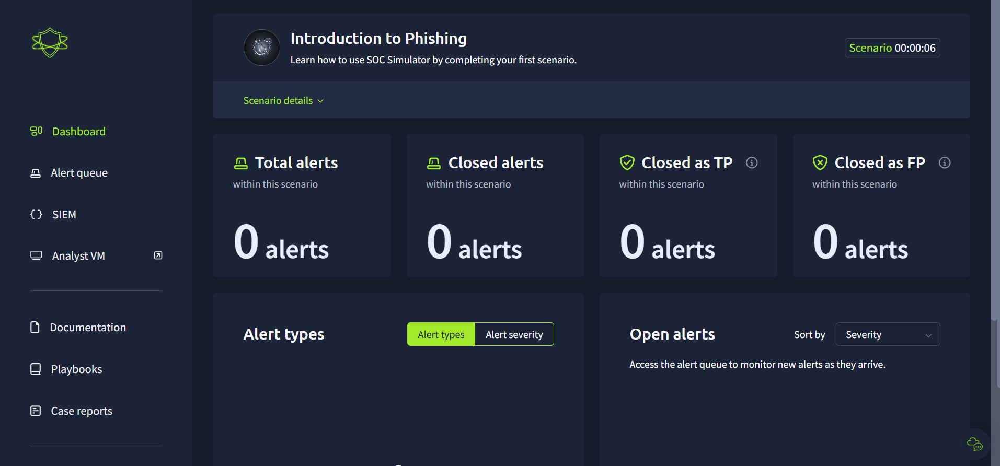

I am presented with the main SOC dashboard, which displays:

- Total alerts  
- Alerts marked as **True Positive**  
- Alerts marked as **False Positive**  
- Alert types  
- Open alerts  
- Time elapsed  

The **time elapsed** metric is particularly important, as it reflects a real SOC constraint — I am required to triage and resolve alerts **as efficiently as possible** while maintaining accuracy.

On the left-hand side of the interface, I can see several core functionalities:

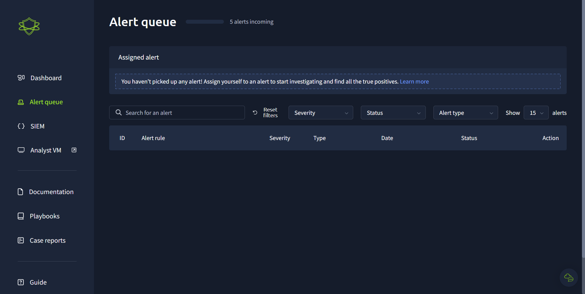 2.png

- **Alert Queue:** Displays all incoming alerts (shown in `2.png`).

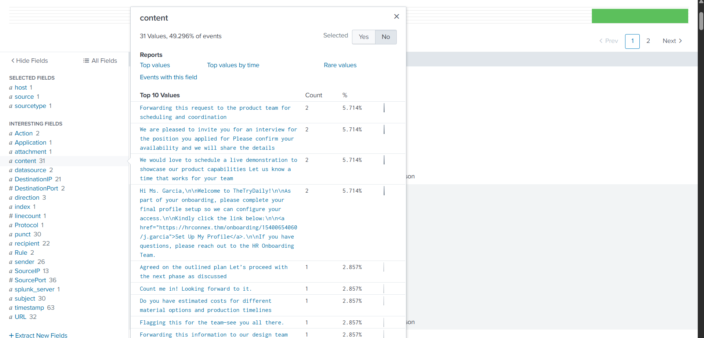 6.png

- **SIEM:** Redirects me to the selected SIEM platform, in this case Splunk (shown in `6.png`).

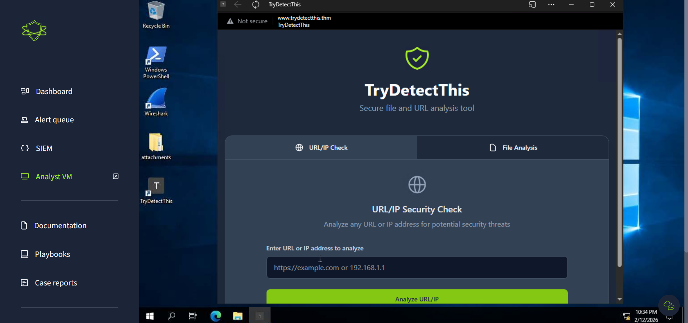 8.png
  
- **Analyst VM:** Provides multiple tools, including the *TryDetectMe* application, which I use to determine whether IPs, URLs, or attachments are malicious or benign (shown in `8.png`).

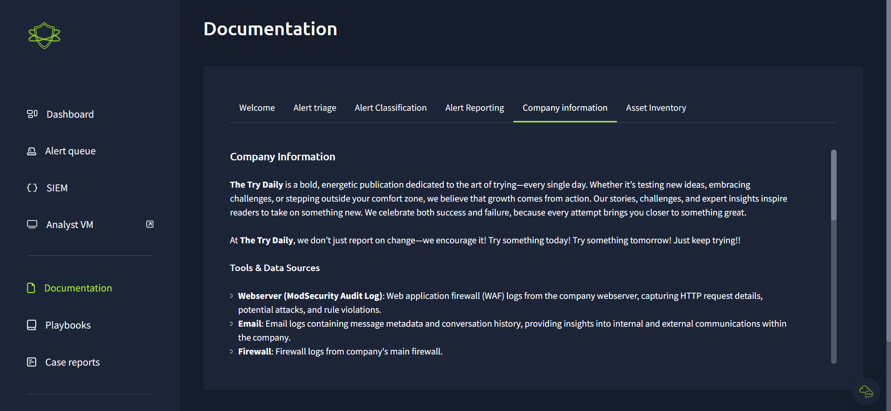 1.1.png
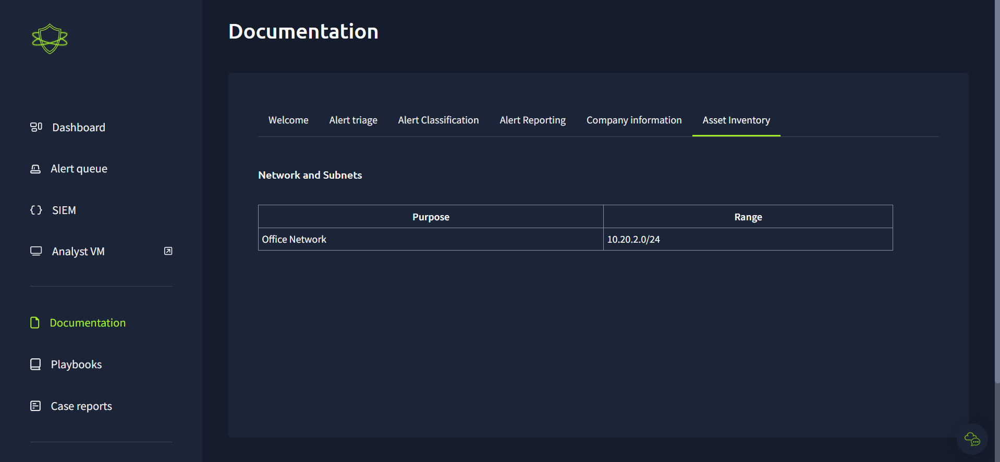 1.2.png

- **Documentation:** Acts as a built-in guide for analysts, explaining how to triage alerts and score them correctly.  
  It also includes:
  - **Company Information:** Adds context by linking IP addresses to internal hosts for better reporting.  
  - **Asset Inventory:** Shows the company subnet, in this case `10.20.2.0/24`, meaning there are 254 hosts on the network (shown in `1.1.png` and `1.2.png`).

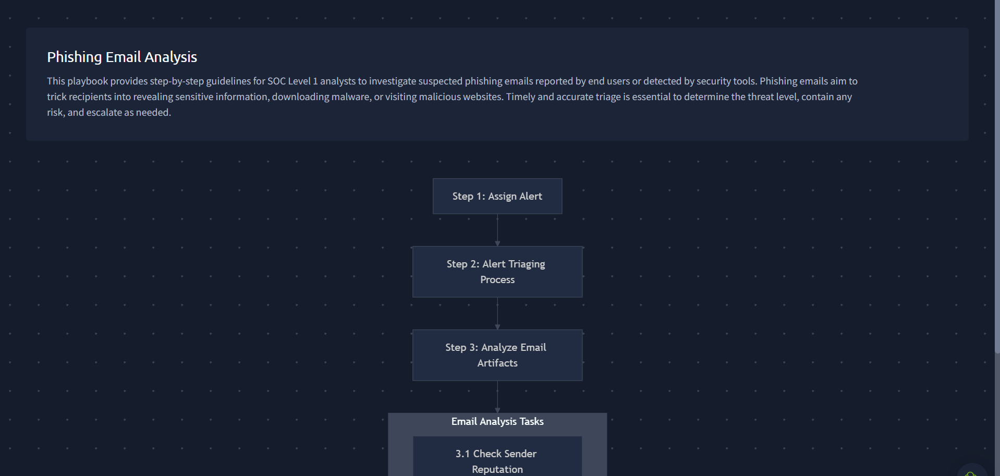 5.png
  
- **Playbooks:** Two playbooks are available in this scenario, but only one was required — the **Phishing Playbook**.  
  This outlines the exact steps I need to follow to ensure consistent investigation and response procedures (shown in `5.png`).  
  Although I was unable to expand the playbook in the interface for some reason, I already understood the required workflow.

This section mainly serves as a baseline to understand how the SOC Simulator works before moving into the core of the scenario.

After familiarizing myself with the interface, I waited for alerts to populate the queue. Approximately four minutes later, the first alert appeared (see `3.png`).

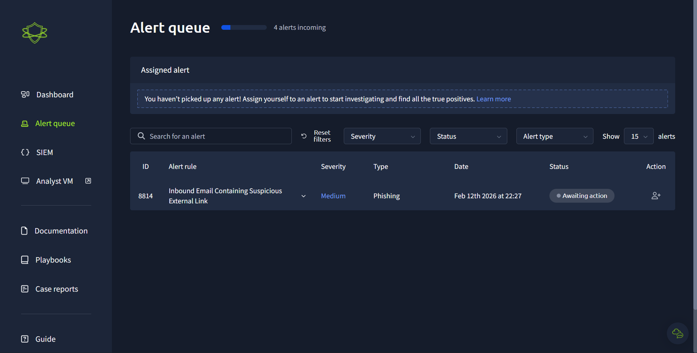 3.png

Upon reviewing the alert details, I saw that it was triggered due to **suspicious external links within an email**. The alert included useful contextual fields such as:

- Sender address  
- Recipient address  
- Embedded link(s)  
- Associated playbook  

These details (shown in `4.png`) were essential for both the remediation process and writing an accurate investigation report.

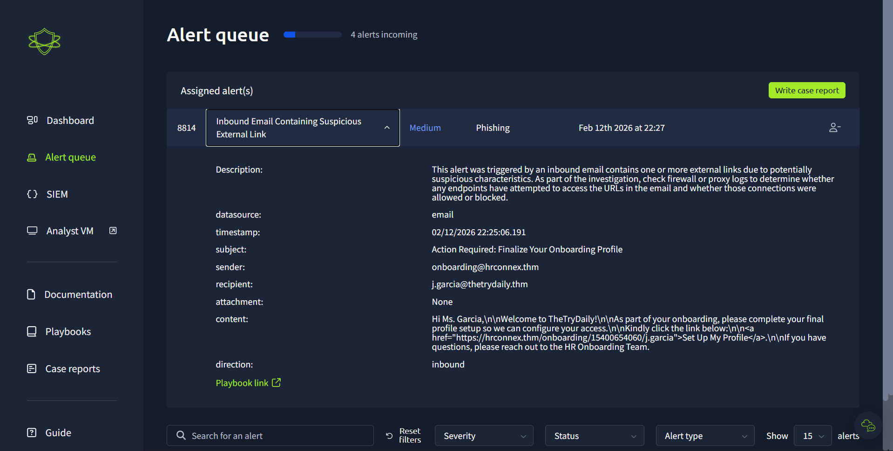 4.png

I then navigated to the SIEM (Splunk) to validate the alert by searching the logs using the information provided in the alert details (`6.png`). In `7.png`, most of the log data aligned with what was described in the alert.

There were no attachments associated with the email, so I focused on the embedded link found in the alert: https://hrconnex.thm/onboarding/15400654060/j.garcia (as shown in `9.png`).

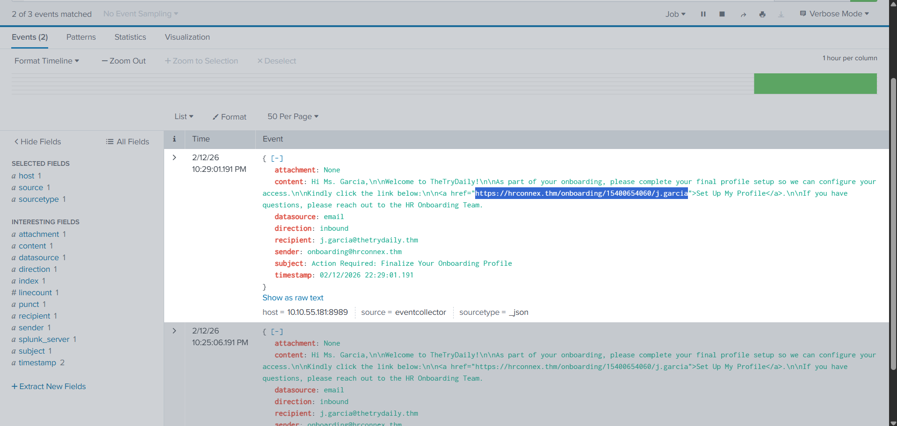 9.png

Before I could fully analyze the link using the Analyst VM, a **High Severity alert** appeared in the alert queue (`2.3.png`). Following SOC best practices, I immediately prioritized the high-severity alert. Although there was no formal "parking" function available, I stopped working on the medium alert and shifted focus.

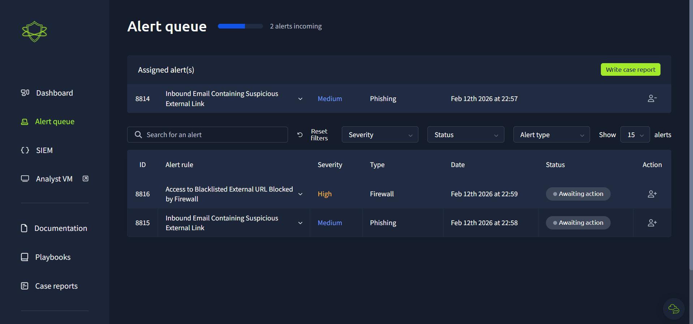 2.3.png

The high-severity alert indicated that a user had attempted to access the malicious external link from the phishing email. Fortunately, the firewall had successfully blocked the outbound connection.

 13.png

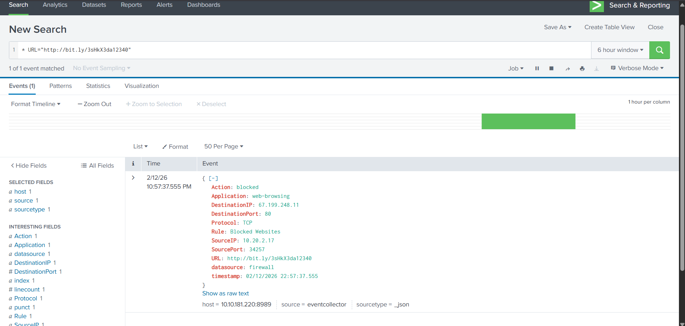 14.png

I returned to Splunk and searched for the relevant firewall logs by filtering for the external URL mentioned in the alert. I was able to locate the event quickly (see `13.png` and `14.png`).

Next, I used the Analyst VM to verify whether the URL and sender IP were malicious. The analysis confirmed that both were indeed malicious (`15.png`).

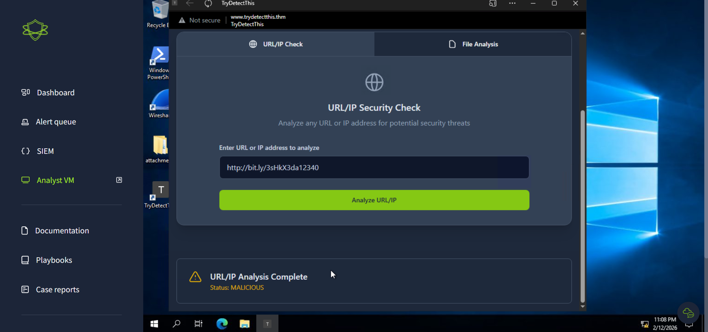 15.png

Based on the findings:

- The link was malicious.  
- The firewall successfully blocked the connection.  
- No payload execution or internal compromise occurred.  

I classified this alert as a **True Positive** with **no escalation required**, since the threat was successfully mitigated at the network boundary.

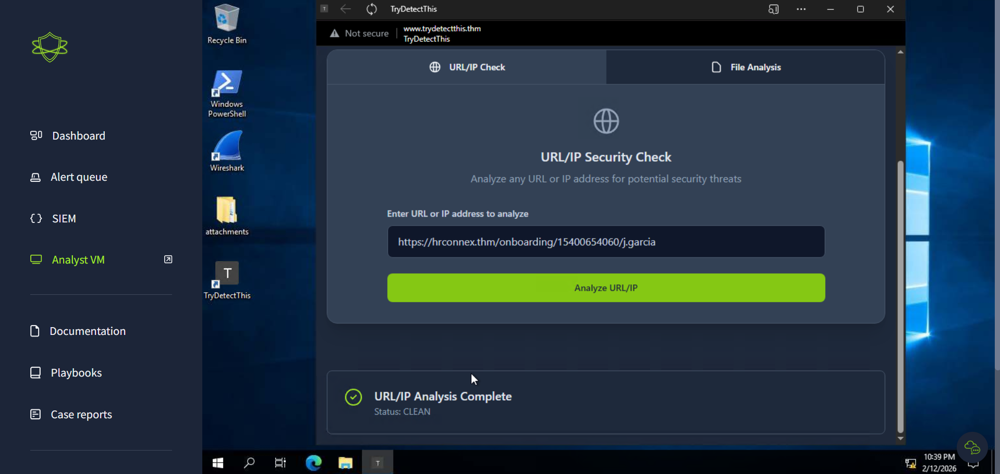 10.png

I documented the findings and classified the alert as a **False Positive**, explaining the reasoning clearly in the report.

After resolving the previous alerts, I checked the Alert Queue and was surprised to see that all five alerts had now arrived. Each of them was marked with a **Medium severity** rating. Following general SOC best practice, I prioritized the **oldest alert first** to ensure proper queue management and SLA alignment.

The first medium alert was related to a supposed *Amazon delivery failure* email instructing the user to click a suspicious link. Upon reviewing the link, I immediately recognized it as the same malicious URL from the earlier high-severity alert — the one that had already been blocked by the firewall (see `19.png`, `20.png`, and `21.png`).

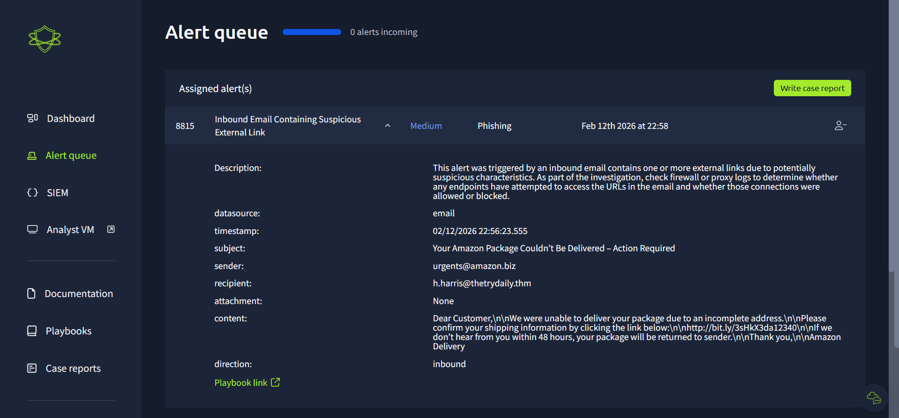 19.png

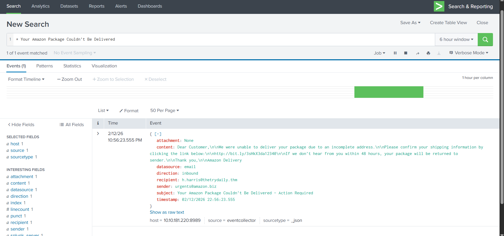 20.png

 21.png

Since the link was previously confirmed as malicious and firewall logs showed successful blocking, I documented the findings and classified the alert as a **True Positive** with **no escalation required**, as the threat had already been mitigated.

---

The next alert was another phishing attempt. This time, I quickly identified a **typosquatted Microsoft domain** masquerading as: m1crosoftsupport.co (as shown in `23.png`).

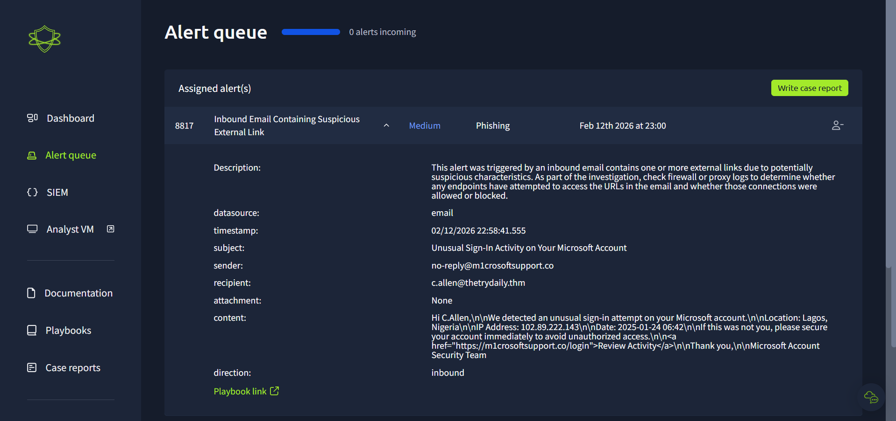 23.png

After reviewing the relevant logs in Splunk and validating the domain in the Analyst VM, I confirmed it was malicious. When writing the report, I followed structured SOC reporting practices by clearly documenting:

- **When** the activity occurred  
- **What** happened  
- **Who** was involved (user, sender, affected asset)  
- **Result/Impact**  

This alert was marked as a **True Positive requiring escalation**, as there was no evidence of the firewall blocking the outbound connection (see `24.png`). This introduced potential risk of user interaction or compromise.

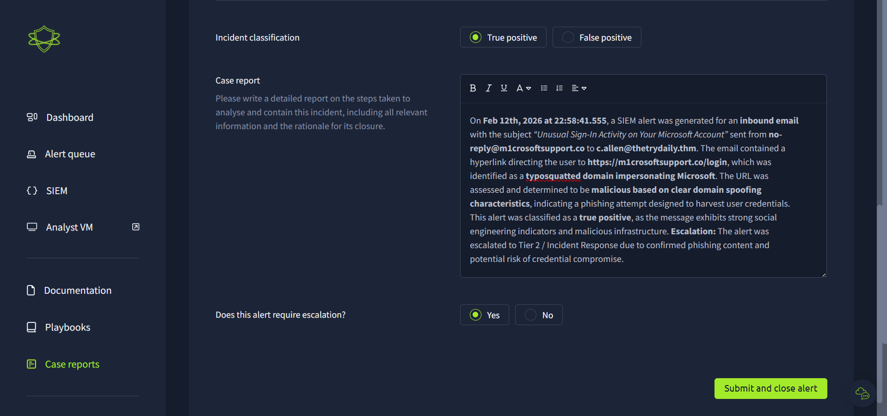 24.png

---

The final alert was similar in nature — another phishing email containing a malicious external link. I repeated the investigative process:

- Reviewed alert details  
- Validated logs in Splunk  
- Checked the URL in the Analyst VM  
- Confirmed malicious activity  

As with the previous alert, there was no indication that the firewall had blocked the connection. Therefore, I marked it as a **True Positive requiring escalation**, following proper incident response protocol.

---

The simulation then concluded abruptly, and I was presented with the completion screen (`25.png`). All alerts were classified correctly, reflecting accurate triage and decision-making throughout the exercise.

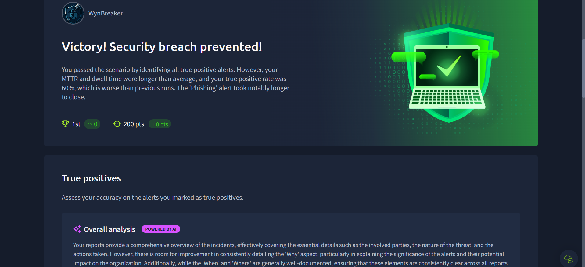 25.png

---

## Lessons Learned

This introductory phishing scenario reinforced several important SOC principles:

- **Severity-based prioritization:** Always handle high-severity alerts first, even if it requires pausing current investigations.  
- **Oldest-first queue management:** Prevents backlog and maintains SLA performance.  
- **Log validation is critical:** Never rely solely on alert descriptions — always confirm with SIEM data.  
- **Consistent reporting structure:** Clear documentation using *When, What, Who, and Impact* improves communication and escalation quality.  
- **Verification before classification:** Always validate URLs, IPs, and sender information using available tools before determining true or false positives.  
- **Escalate when containment is uncertain:** If there is no evidence of blocking or mitigation, assume potential impact and escalate accordingly.  

Overall, this simulation strengthened my understanding of real-world phishing investigations and the importance of disciplined, structured SOC workflows.

