## Scenario 2: Phishing Unfolding

This is the second SOC simulation I completed using the **SOC Simulator on TryHackMe**.  
For this scenario, I primarily used **Splunk SIEM**, although the simulation was later repeated using **ELK** and **Microsoft Sentinel**.

One key observation during setup was that log ingestion and data availability in **Splunk** and **ELK** occurred significantly faster compared to **Microsoft Sentinel**.

As the simulator functionality was covered extensively in Scenario 1, I will focus purely on investigation and alert handling in this walkthrough.

---

### Initial Overview

*Figure 1 – SOC dashboard at the start of the Phishing Unfolding scenario.*

Upon entering the scenario, I noticed a documentation notification and proceeded to review it.

*Figure 2 – Documentation section containing asset inventory, triage guidance, and reporting criteria.*

The documentation provided valuable context, including:

- Company asset inventory  
- Alert triage procedures  
- Alert classification criteria  
- Reporting guidelines  

The welcome page varies depending on the SIEM used. For example, when using **Microsoft Sentinel**, Azure credentials (username and password) are provided:

*Figure 3 – Azure credentials shown when using Microsoft Sentinel.*

This credential page does not appear when using ELK or Splunk.

Another notable difference in this scenario was the absence of playbooks, which meant I relied strictly on SOC best practices and investigative reasoning.

---

### Alert 1 – Suspicious Banking Email (Low Severity)

After a few minutes, the first alert appeared.

*Figure 4 – First alert appears in the alert queue (36 total alerts expected).*

The alert indicated a suspicious email requesting the recipient to urgently provide banking details.

*Figure 5 – Alert details showing a request for banking information.*

I pivoted to Splunk and searched for the recipient to locate the email event.

*Figure 6 – Email located in Splunk using recipient-based query.*

I specifically searched the recipient’s activity to determine whether:

- The user replied with sensitive information  
- Any attachments were involved  
- Any embedded URLs were present  

There were **no attachments**, **no URLs**, and **no reply containing sensitive data**. Because no malicious indicators were present and no user interaction occurred, I determined that this email resembled **spam rather than phishing**.

After monitoring briefly to confirm no further suspicious behavior, I wrote a report marking this alert as a **False Positive**, and the case was closed.

---

### Alert 2 – Suspicious Process on Host win-3459

Immediately after closing the previous case, another low-severity alert arrived.

*Figure 7 – Alert indicating a suspicious process on host win-3459.*

I queried the host in Splunk to investigate the process tree.

*Figure 8 – Process lineage and event investigation in Splunk.*

My objective was to determine:

- Whether the process was spawned by a malicious parent  
- Whether it spawned additional suspicious child processes  
- Whether there were correlated abnormal events  

Everything appeared legitimate. The process originated from a valid parent process and no abnormal child processes were observed.

I documented the findings and classified the alert as a **False Positive**.

*Figure 9 – Case report marking the alert as False Positive.*

---

### Alert 3 – Additional Suspicious Process

While working on the previous alert, another low-severity suspicious process alert arrived.

*Figure 10 – Additional suspicious process alert in the queue.*

I noted the host details and searched for the process in Splunk.

*Figure 11 – SIEM search results for the flagged process.*

There were no additional correlated events beyond the single logged instance. I waited to observe whether further suspicious activity would occur, but none followed.

Given the absence of malicious behavior, unusual spawning activity, or lateral movement indicators, I classified this alert as a **False Positive**.

*Figure 12 – Case report marking the second process alert as False Positive.*

---

### Alert 4 – Phishing Email (No Attachments or Links)

While investigating the previous alert, two more low-severity alerts accumulated in the queue. Following SOC best practices, I selected the **oldest alert first**.

*Figure 13 – Phishing email alert without attachments or external links.*

This alert was similar to the earlier spam-style phishing attempt. The email contained no attachments and no external URLs.

I pivoted to the SIEM to check for:

- Any user replies  
- Any outbound communication  
- Any abnormal activity from the recipient  

*Figure 14 – SIEM results showing no user interaction.*

After waiting briefly to ensure no delayed activity appeared, I confirmed there was no interaction. I classified the alert as a **False Positive** and documented my findings.

*Figure 15 – Case report marking the alert as False Positive.*

---

### Alert 5 – Additional Phishing Email (No Malicious Indicators)

By this stage, approximately four low-severity alerts were waiting in the queue. Again, I selected the oldest alert.

*Figure 16 – Another phishing email alert.*

I repeated the same structured investigation process:

1. Reviewed alert details  
2. Queried the SIEM  
3. Checked for user interaction  
4. Verified presence of attachments or links  

*Figure 17 – SIEM search confirming no malicious activity.*

There were no malicious links, no attachments, and no user interaction. I documented the findings and marked it as a **False Positive**.

*Figure 18 – Case report confirming False Positive classification.*

---

### Alert 6 – Phishing Email with Malicious Attachment (Host: win-3450)

After closing the previous alert, the number of pending alerts remained unchanged. I moved to the next oldest alert, which involved a phishing email sent to **host win-3450** that contained an attachment — this immediately raised the risk level.

I began by searching for related logs in the SIEM.

*Figure 19 – SIEM query for email containing attachment.*

While waiting for logs to accumulate, I analyzed the attachment using the Analyst VM.

The ZIP archive itself appeared clean. However, the file inside the archive — `invoice.pdf.lnk` — was flagged as malicious.

*Figure 20 – ZIP file scan result (clean).*

*Figure 21 – Embedded LNK file flagged as malicious.*

This indicated a clear malicious delivery mechanism using a disguised shortcut file.

---

### Alert 7 – Suspicious Process (rdpclip.exe)

While waiting for additional correlated logs, I proceeded to the next alert in the queue, which was also associated with host **win-3450**.

*Figure 22 – Alert showing rdpclip.exe spawned from svchost.exe.*

The process `rdpclip.exe` is related to Remote Desktop Protocol (RDP), so I approached this investigation cautiously due to its potential use in lateral movement.

I queried the SIEM to review the process lineage and surrounding activity.

*Figure 23 – Process lineage investigation in SIEM.*

There was no suspicious user interaction prior to the process spawn. Additionally, `rdpclip.exe` was spawned from the expected parent process (`svchost.exe`), which is consistent with legitimate Windows behavior.

Based on these findings, I classified this alert as a **False Positive**.

*Figure 24 – Case report marking rdpclip.exe alert as False Positive.*

---

### Alert 8 – taskhostw.exe (KEYROAMING) Process

The next alert involved `taskhostw.exe` with a `KEYROAMING` process spawned from `svchost.exe`.

*Figure 25 – taskhostw.exe KEYROAMING process alert.*

Although this appeared to be normal Windows activity at first glance, I validated it in the SIEM to maintain investigative discipline.

*Figure 26 – SIEM validation of taskhostw.exe activity.*

The logs confirmed normal system behavior with no suspicious parent-child process anomalies.

I documented the findings and marked the alert as a **False Positive**.

*Figure 27 – Case report confirming False Positive classification.*

---

### Alert 9 – Suspicious Process (WUDFHost.exe)

By this point, there were approximately six alerts waiting in the queue, all still marked as **Low Severity**. Following SOC queue management best practices, I selected the oldest alert.

*Figure 28 – Alert indicating WUDFHost.exe spawned from services.exe.*

The alert indicated that `WUDFHost.exe` was spawned from `services.exe`. At first glance, this appeared legitimate, as `WUDFHost.exe` (Windows Driver Foundation Host) commonly runs under `services.exe`.

To ensure there was no misuse, I performed deeper log analysis in the SIEM.

*Figure 29 – Process command-line and event log analysis.*

I carefully reviewed the process command string and surrounding activity to confirm:

- No suspicious child processes were spawned  
- No abnormal command-line arguments were used  
- No unusual outbound network connections were initiated  

Everything aligned with expected system behavior. Based on these findings, I documented the case and marked the alert as a **False Positive**.

*Figure 30 – Case report confirming False Positive classification.*

---

### Alert 10 – Suspicious Process (rdpclip.exe)

The next alert involved `rdpclip.exe` spawned from `svchost.exe`, similar to a previous alert I had already investigated.

*Figure 31 – rdpclip.exe process alert.*

Given the similarity to the earlier case, I anticipated the outcome but still conducted a quick validation in the SIEM to maintain investigative consistency.

*Figure 32 – SIEM validation of rdpclip.exe process activity.*

The logs confirmed normal behavior with no suspicious activity, lateral movement, or anomalous process spawning.

I documented the findings and marked the alert as a **False Positive**.

*Figure 33 – Case report confirming False Positive classification.*

---

### Alert 11 – Suspicious Process (WUDFHost.exe – Same Host)

The next alert was again related to `WUDFHost.exe` spawned from `services.exe`, similar to Alert 9 and originating from the same host.

*Figure 34 – Repeated WUDFHost.exe process alert.*

Since this pattern had already been validated, I conducted a quick SIEM verification to confirm consistency.

*Figure 35 – Log validation for repeated WUDFHost.exe alert.*

The logs showed expected Windows system behavior with no suspicious command-line arguments or child processes.

I completed the case documentation and classified the alert as a **False Positive**.

*Figure 36 – Case report marking the alert as False Positive.*

---

### Alert 12 – Phishing Email (Spam Pattern)

The next alert was another phishing email alert. However, unlike the earlier `invoice.pdf.lnk` case, this email contained no attachments or embedded malicious links and followed the same pattern as the previously identified false positive spam emails.

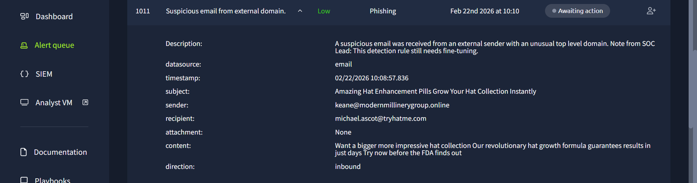

*Figure 37 – Phishing alert resembling previous spam-style emails.*

Based on prior investigations, I was able to triage this alert efficiently. I still validated my assumption by checking the SIEM logs.

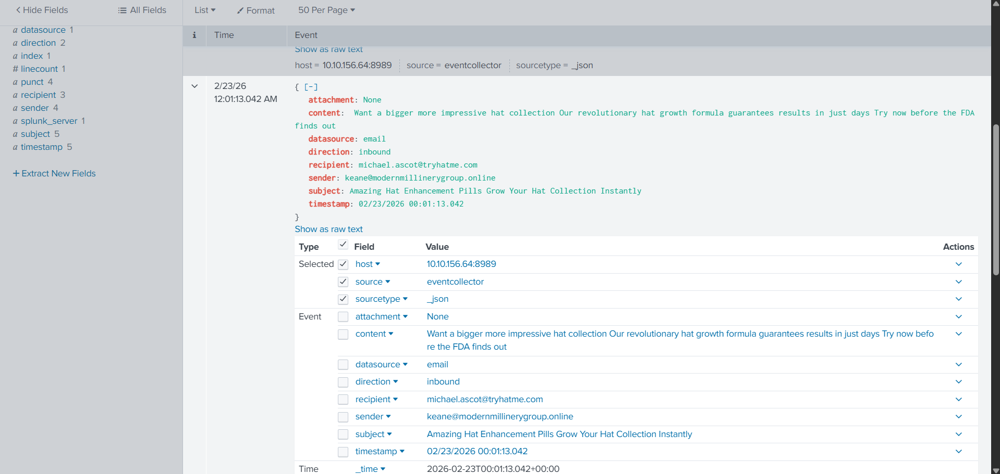

*Figure 38 – Log review confirming no malicious interaction.*

There were no user replies, no attachments, and no suspicious outbound connections. I documented the findings and classified the alert as a **False Positive**, noting that the pattern resembled spam rather than a targeted phishing attempt.

It is important to note that at this stage, there were still no new correlated alerts related to the `invoice.pdf.lnk` attachment. While waiting for additional logs or activity, I proceeded to the next alert.

---

### Alert 13 – Additional Phishing Email (Spam)

The following alert was again a phishing email with characteristics similar to earlier false positives.

*Figure 39 – Additional phishing email alert showing spam characteristics.*

I performed a quick SIEM validation following the same structured triage process used in previous phishing investigations.

*Figure 40 – Log analysis confirming no malicious indicators.*

After confirming there were no attachments, malicious URLs, or user interaction, I wrote a **False Positive** case report.

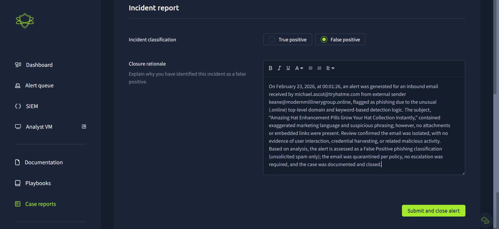

*Figure 41 – Case report confirming False Positive classification.*

---

### Alert 14 – Suspicious svchost.exe Command-Line Activity

Although new alerts had arrived in the queue, they were still marked as **Low Severity**, so I selected the oldest one.

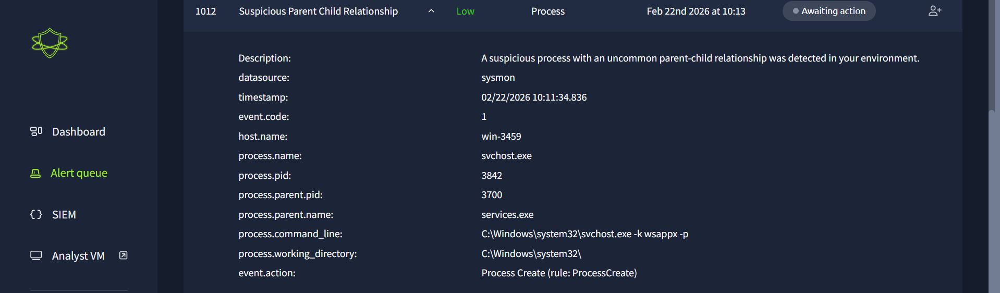

*Figure 42 – Suspicious command-line activity involving svchost.exe.*

I was initially unsure about the command-line parameters being executed by `svchost.exe`, so I investigated further in the SIEM.

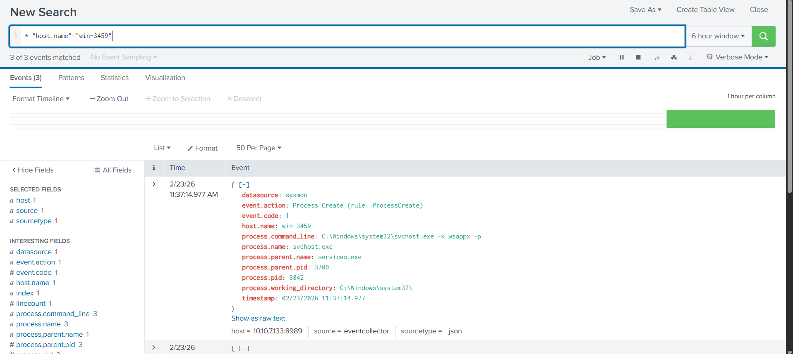

*Figure 43 – SIEM log analysis of svchost.exe command string.*

I examined:

- Process lineage  
- Child processes  
- Network connections  
- Abnormal arguments  

There were no suspicious child processes spawned and no anomalous network connections. To ensure due diligence, I conducted a brief external verification of the command-line behavior to confirm it aligned with legitimate Windows operations.

After validation, I documented the findings and classified the alert as a **False Positive**.

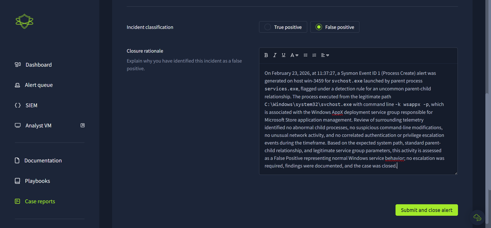

*Figure 44 – Case report marking svchost.exe alert as False Positive.*

---

### Alert 15 – Phishing Email (Repeated Spam Pattern)

At this point, approximately eight low-severity alerts remained in the queue. As before, I selected the oldest alert.

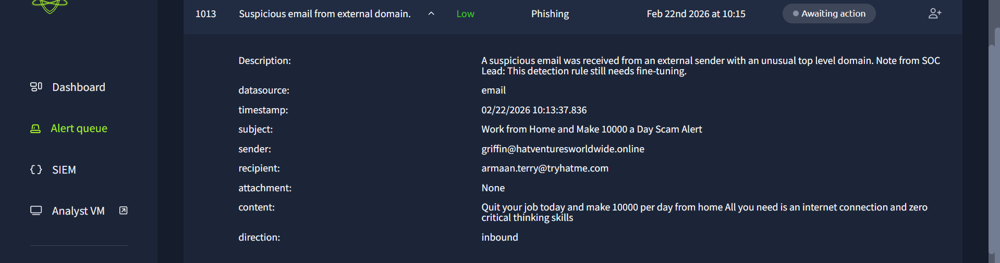

*Figure 45 – Additional phishing email alert.*

The email displayed the same spam-like characteristics as earlier false positives. I performed a quick SIEM validation.

*Figure 46 – Log validation confirming no malicious interaction.*

There were no malicious indicators or user engagement. I documented the case and classified it as a **False Positive**.

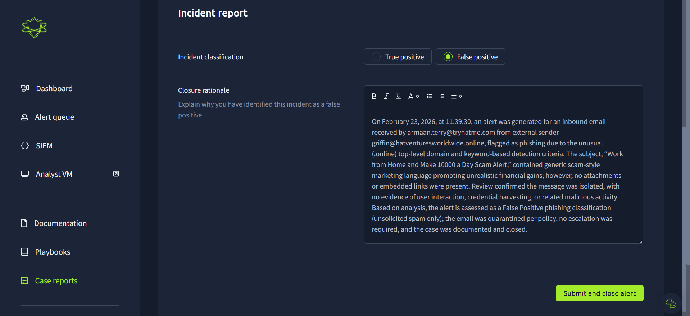

*Figure 47 – Case report confirming False Positive classification.*

---

### Alert 16 – Phishing Email (Spam Pattern)

The next alert was another phishing email displaying the same characteristics as the previous spam-style false positives.

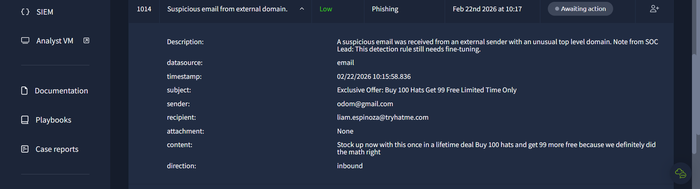

*Figure 48 – Phishing email alert resembling previous spam patterns.*

I followed the same triage workflow:

- Reviewed alert details  
- Checked for attachments or URLs  
- Queried SIEM for user interaction  
- Monitored for outbound connections  

*Figure 49 – SIEM log review confirming no malicious activity.*

There were no malicious indicators or user engagement. I documented the findings and marked the alert as a **False Positive**.

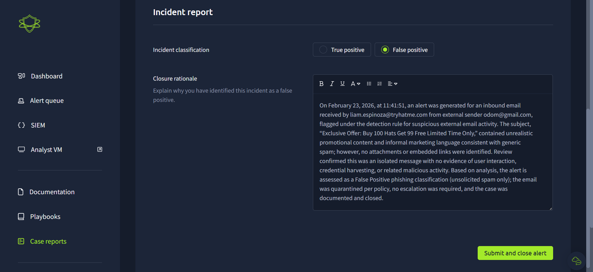

*Figure 50 – Case report confirming False Positive classification.*

---

### Alert 17 – Suspicious Process (TrustedInstaller.exe)

The next alert involved `services.exe` executing `TrustedInstaller.exe`, expedited from Sysmon.

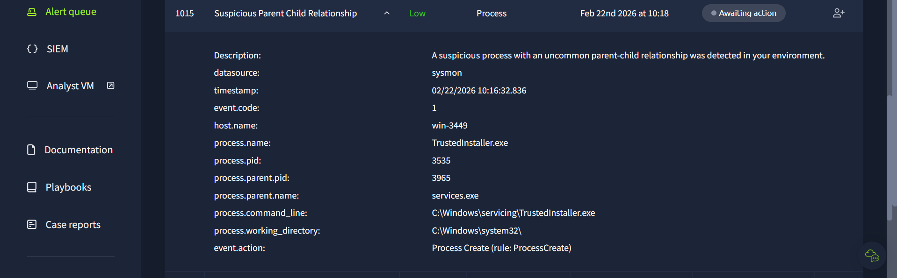

*Figure 51 – services.exe spawning TrustedInstaller.exe.*

Attackers often attempt to masquerade as legitimate Windows processes, and `TrustedInstaller.exe` is a high-privilege system process. Therefore, I investigated thoroughly.

I analyzed the logs both before and after the process execution.

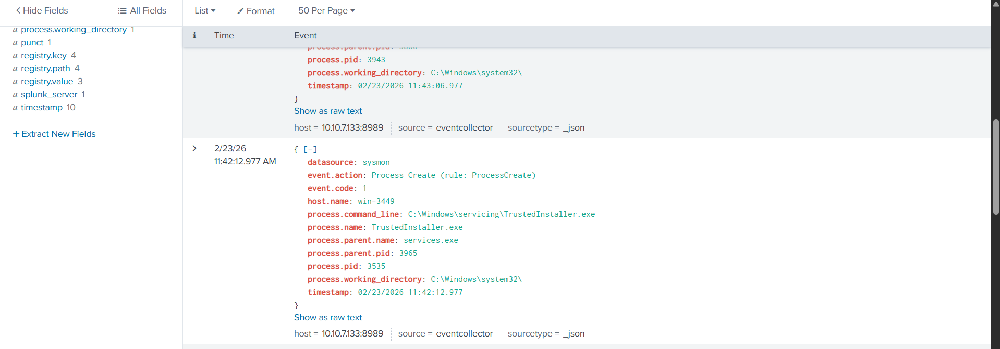

*Figure 52 – SIEM investigation of TrustedInstaller activity.*

I reviewed:

- Parent-child process relationships  
- Command-line arguments  
- Subsequent spawned processes  
- Network connections  

There were no suspicious indicators. The process originated from a legitimate parent and behaved as expected.

I documented the findings and marked the alert as a **False Positive**.

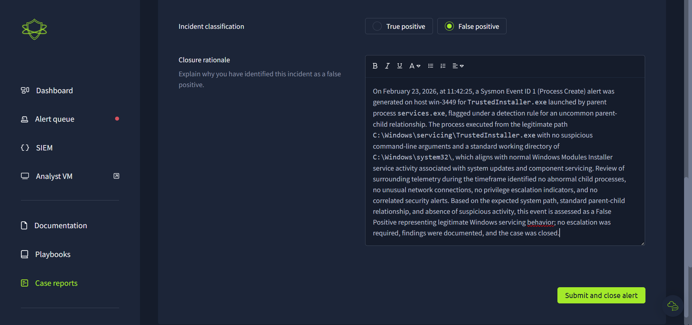

*Figure 53 – Case report confirming False Positive classification.*

---

### Alert 18 – Suspicious Process (taskhostw.exe – NGCKeyPregen)

The following alert involved `taskhostw.exe`, but instead of the `KEYROAMING` command-line parameter seen earlier, it used `NGCKeyPregen`.

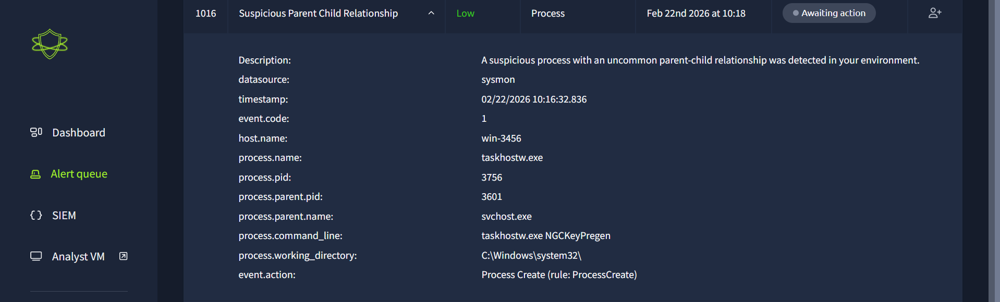

*Figure 54 – taskhostw.exe with NGCKeyPregen command line.*

From prior knowledge, I recognized `NGCKeyPregen` as legitimate Windows functionality related to credential services. Nevertheless, I validated it in the SIEM.

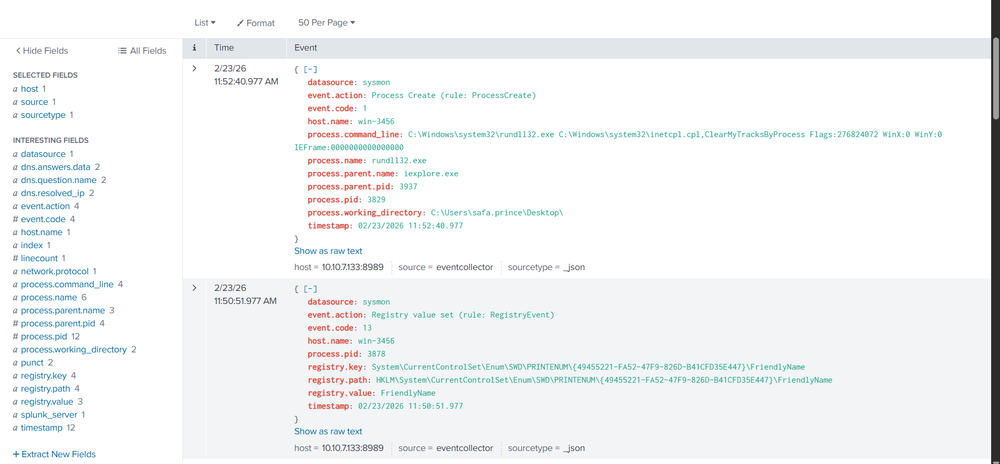

*Figure 55 – SIEM log investigation of taskhostw.exe.*

I checked for:

- Abnormal process lineage  
- Suspicious child processes  
- Network anomalies  

Everything aligned with legitimate system behavior. I wrote a **False Positive** case report.

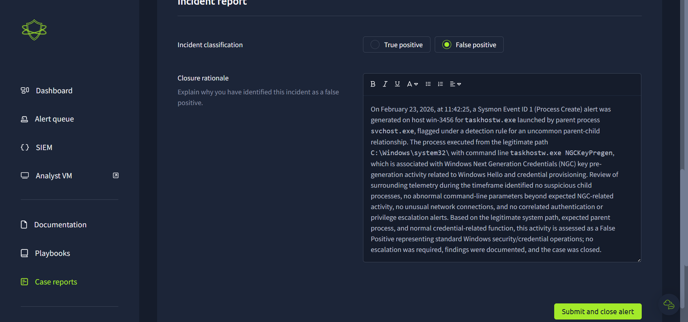

*Figure 56 – Case report marking alert as False Positive.*

---

### Alert 19 – Phishing Email (Spam Pattern)

The next alert was another phishing email with the same spam-like characteristics as earlier alerts.

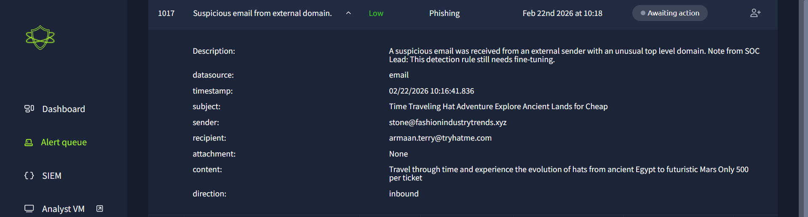

*Figure 57 – Phishing email resembling earlier false positives.*

I performed a quick triage following the established workflow.

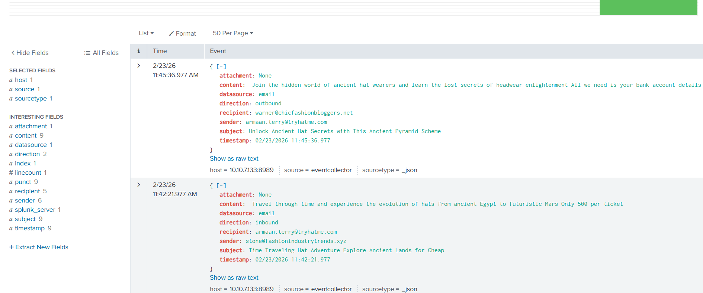

*Figure 58 – Log validation confirming no suspicious activity.*

There were no attachments, malicious links, or user interactions. I classified the alert as a **False Positive**.

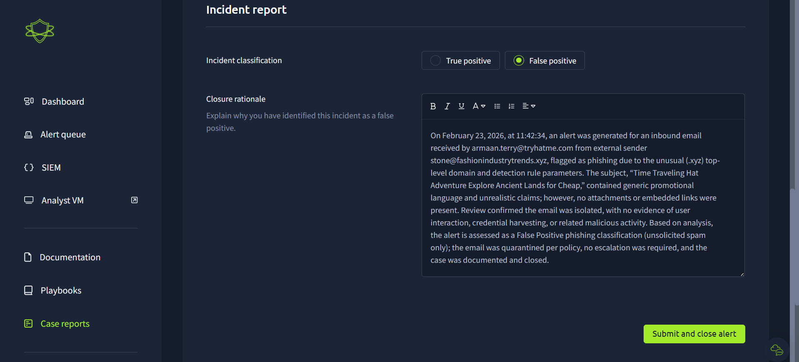

*Figure 59 – Case report confirming False Positive classification.*

---

### Alert 20 – Medium Severity: Suspicious Network Share Mapping

At this point, new alerts appeared in the queue marked as **Medium Severity**. Following prioritization best practices, I immediately took ownership of the oldest medium-severity alert.

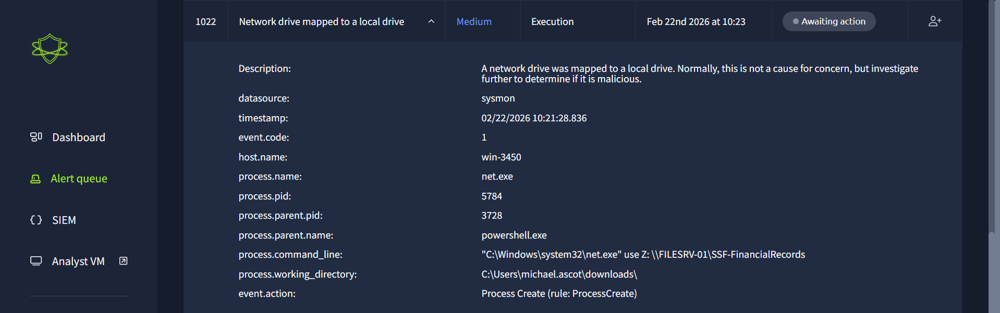

*Figure 60 – Network share mapped to local drive (SSF-Financial-Records).*

The alert indicated that a network share named **"SSF-Financial-Records"** was mapped to a local drive. While this could be legitimate, I noticed the host matched the one that previously received the malicious `invoice.pdf.lnk` attachment.

I investigated the logs surrounding the suspicious process.

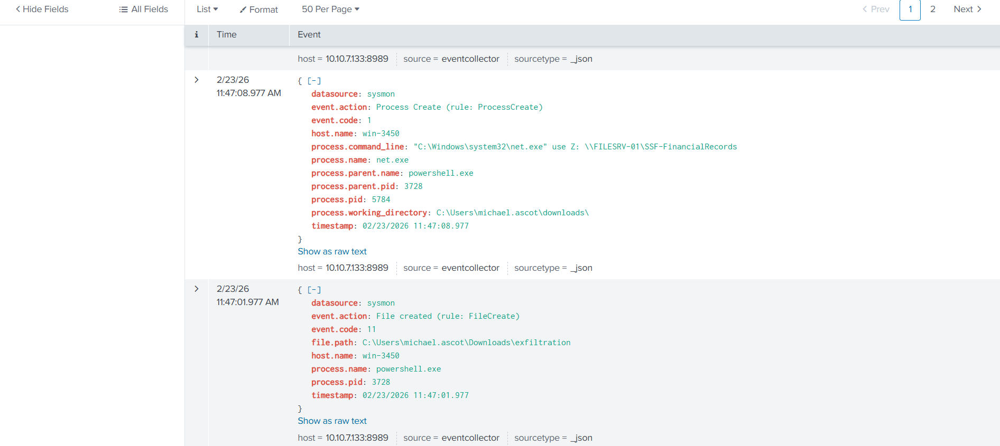

*Figure 61 – Discovery of suspicious "exfiltration" folder.*

Immediately, I observed a folder named **exfiltration**, which significantly increased suspicion. Scrolling further down the logs revealed that `PowerView.ps1` — a known post-exploitation reconnaissance tool — had been downloaded and executed.

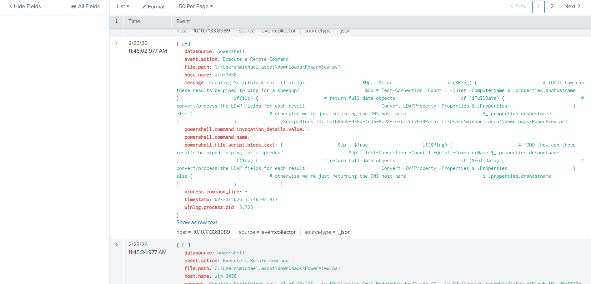

*Figure 62 – PowerView.ps1 downloaded and executed.*

At this stage, I was able to correlate the activity back to the earlier phishing email containing `invoice.pdf.lnk`. The logs confirmed that the user had indeed interacted with the malicious attachment.

This changed the investigative posture entirely.

I immediately:

- Marked the medium-severity execution alert as a **True Positive – Escalation Required**  
- Reopened and updated the previously investigated phishing alert containing `invoice.pdf.lnk`  
- Marked it as **True Positive – Escalation Required**  

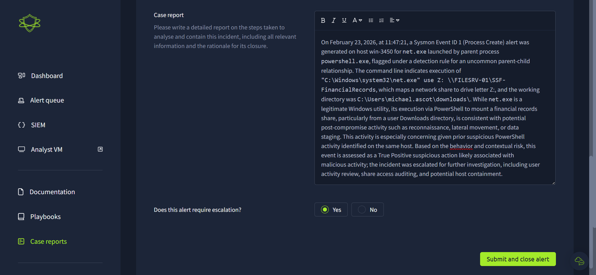

*Figure 63 – Escalation report for suspicious execution.*

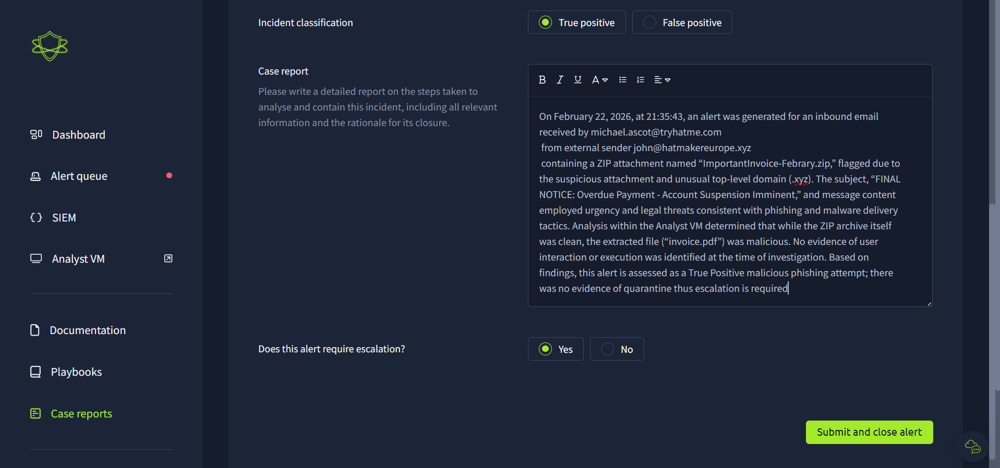

*Figure 64 – Updated report for invoice.pdf.lnk phishing alert.*

This marked the first confirmed compromise in the scenario and demonstrated the importance of correlating seemingly isolated low-severity alerts with later higher-severity activity.

---

### Alert 21 – Medium Severity: Network Share Deletion

Another **Medium Severity** alert appeared in the queue. Following SOC prioritization best practices, I addressed it before returning to low-severity alerts.

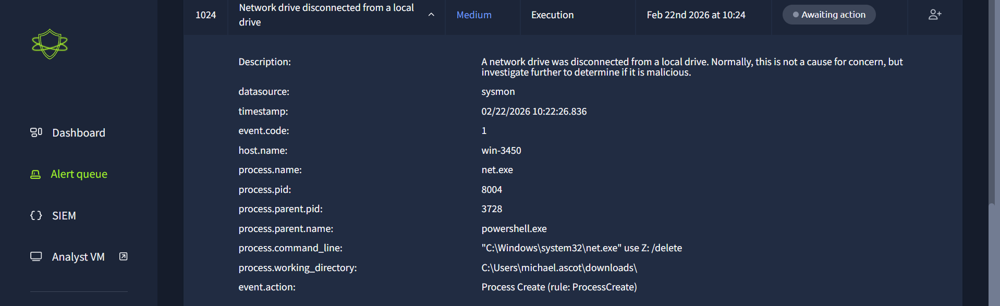

*Figure 65 – `net use Z: /delete` removing mapped network share.*

This alert was a continuation of the earlier compromise. The attacker used: net use Z: /delete

This indicates the network share was removed after files were likely accessed or copied.

Since malicious activity on the host had already been confirmed, I performed a quick validation in the logs.

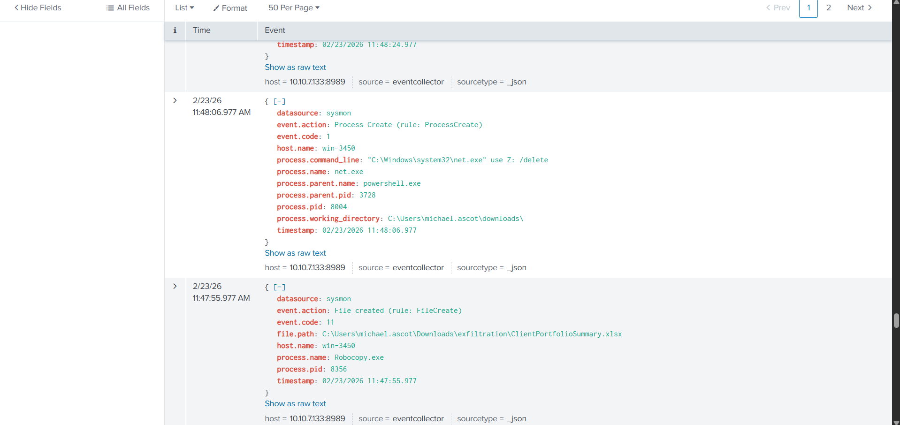

*Figure 66 – SIEM logs confirming deletion command execution.*

The activity aligned with post-exfiltration cleanup behavior. I documented the findings and marked the alert as:

**True Positive – Escalation Required**

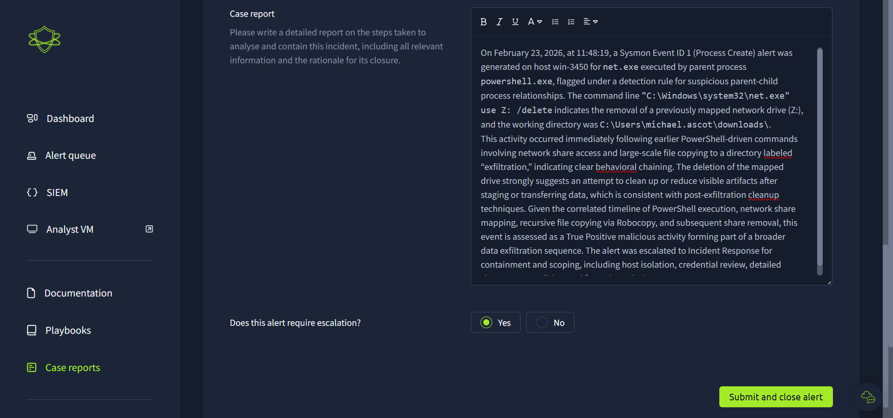

*Figure 67 – Case report confirming malicious activity.*

---

### Alerts 22–31 – High Severity: DNS Exfiltration via nslookup

Shortly after, multiple **High Severity** alerts appeared in the queue. Per SOC best practices, I immediately pivoted to these.

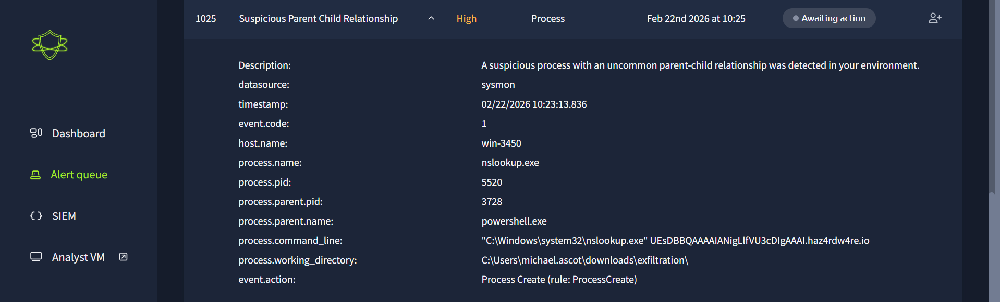

*Figure 68 – High severity suspicious process alerts.*

Across Figures 29.png through 38.png, the alerts showed repeated executions of: nslookup targeting suspicious domains.

Given the confirmed compromise earlier in the investigation, this strongly indicated **DNS-based data exfiltration**.

I validated this by reviewing the logs:

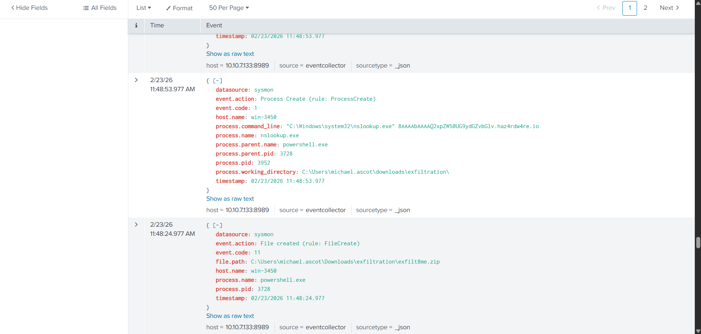  
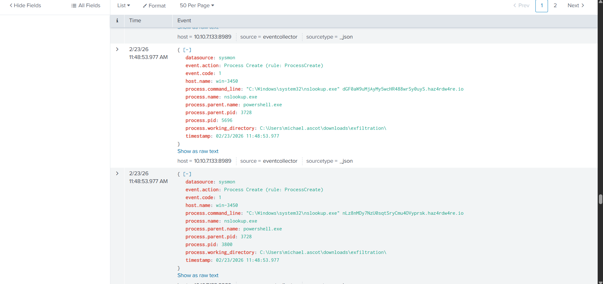  
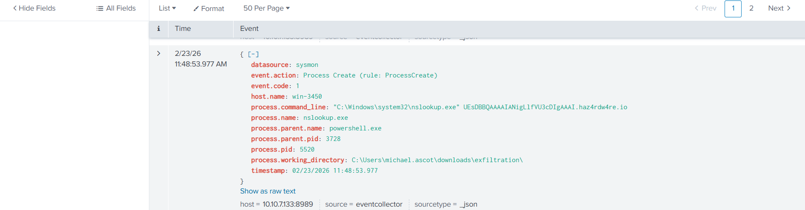  
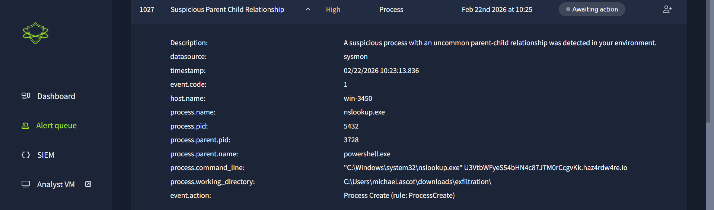

*Figures 69–72 – Logs confirming suspicious DNS queries to malicious domains.*

The logs demonstrated:

- Repeated `nslookup` executions  
- Suspicious and encoded subdomains  
- Queries to external malicious domains  
- Behavior consistent with staged data exfiltration  

I submitted **True Positive – Escalation Required** case reports for each high-severity alert. The corresponding case report screenshots are linked below:

- 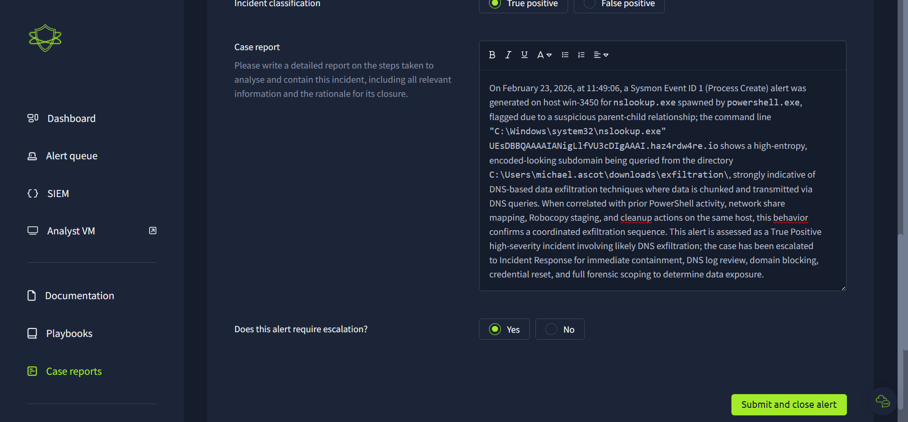  
- 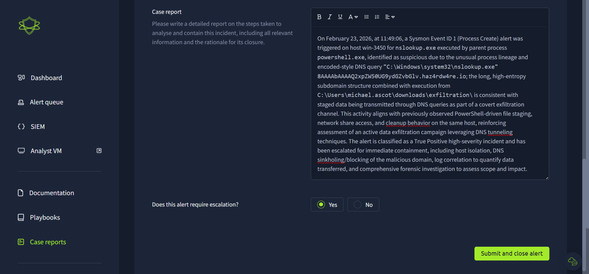  
- 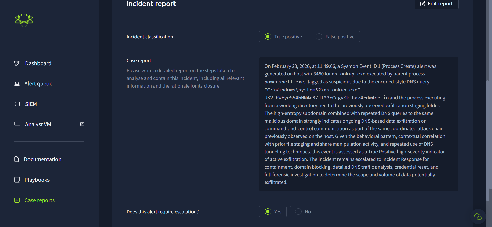  
- 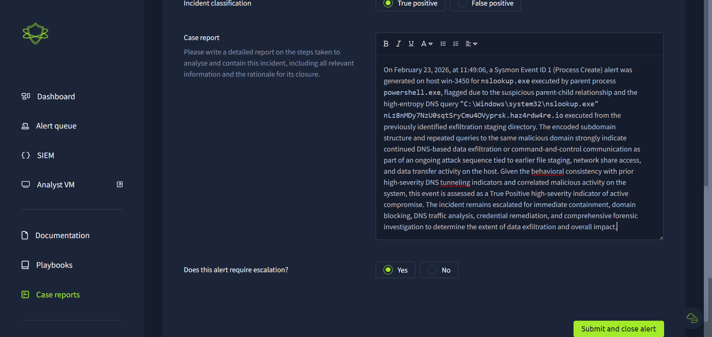  
-   
- 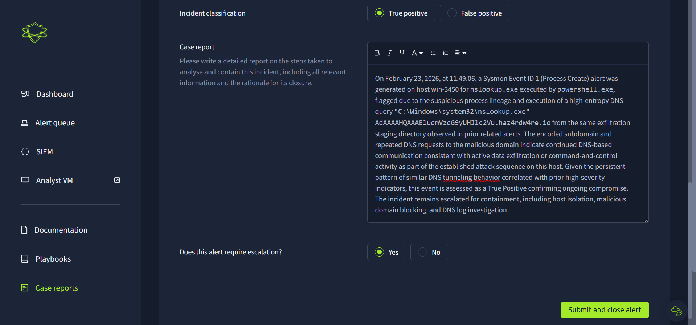  
- 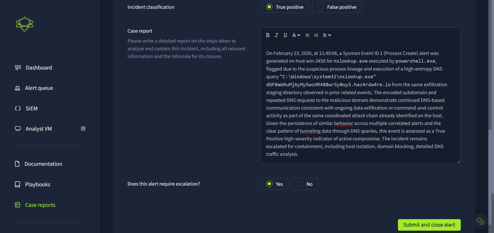  
- 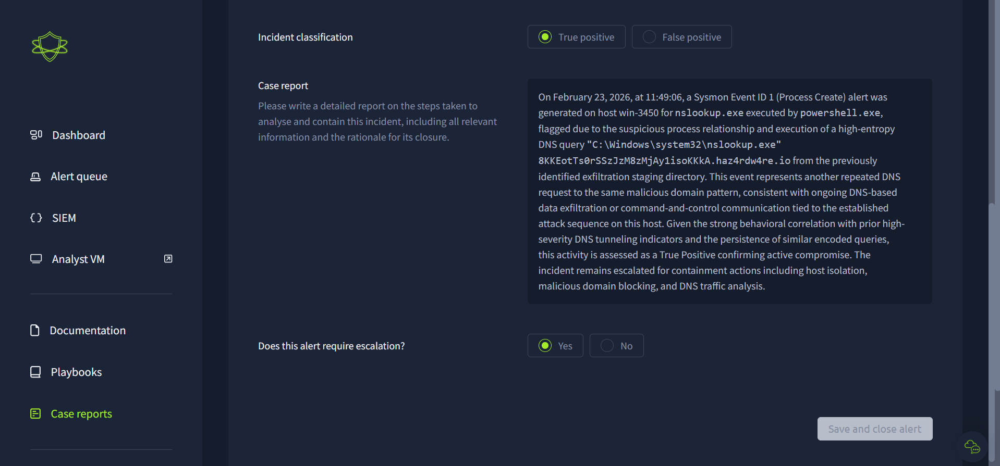  
- 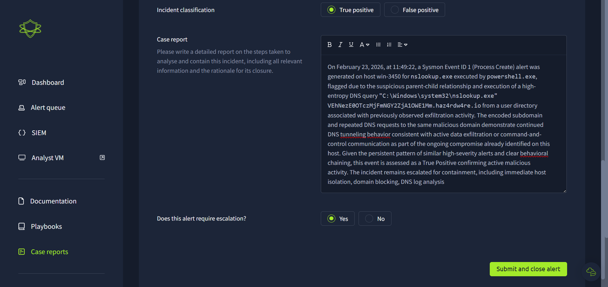  
-   

Each report documented:

- Confirmed DNS exfiltration activity  
- Correlation with the original phishing compromise (`invoice.pdf.lnk`)  
- Evidence of attacker progression through the kill chain  
- Immediate escalation to Incident Response  

---

This stage confirmed full attack lifecycle progression:

1. Initial phishing compromise  
2. Payload execution  
3. Post-exploitation activity  
4. Network share access  
5. Cleanup actions  
6. DNS-based data exfiltration  

This reinforces the importance of correlating alerts across severity levels to uncover the complete intrusion timeline.

---

### Alert 32 – Low Severity: Phishing Email (Spam)

Before proceeding further with medium alerts, I returned to the remaining low-severity alerts.

As shown in 22.png, this was another spam-style phishing alert with no external links or attachments.

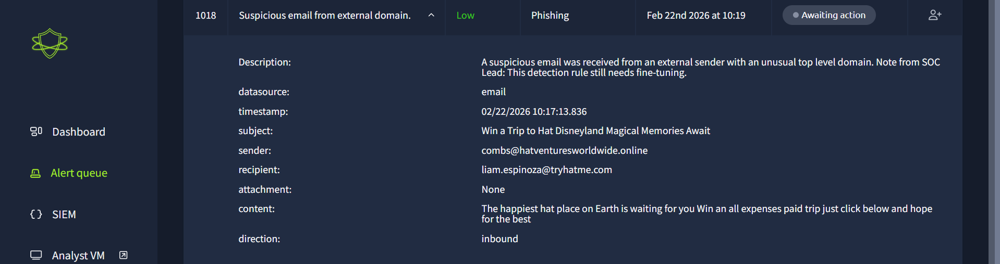

*Figure 73 – Low severity spam email alert.*

Following the established triage process:

- Reviewed email headers and content  
- Checked for attachments or embedded links  
- Queried SIEM for user interaction  
- Monitored for outbound connections  

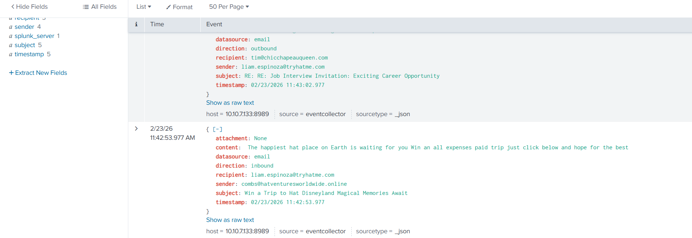

No malicious indicators were identified. The alert was classified as a **False Positive**.

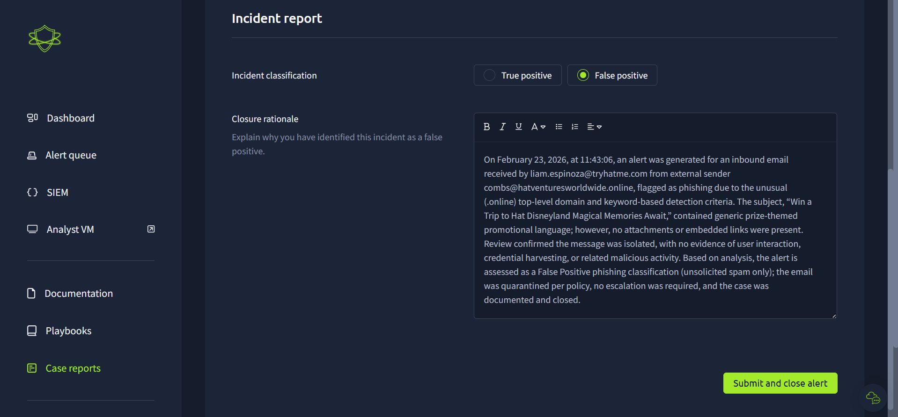

---

### Alert 33 – Low Severity: taskhostw.exe (KEYROAMING)

The next alert involved `taskhostw.exe` with the `KEYROAMING` parameter (23.png).

Although this process had previously been determined legitimate, the host involved was **win-3450**, which had confirmed malicious activity. Therefore, validation was necessary.

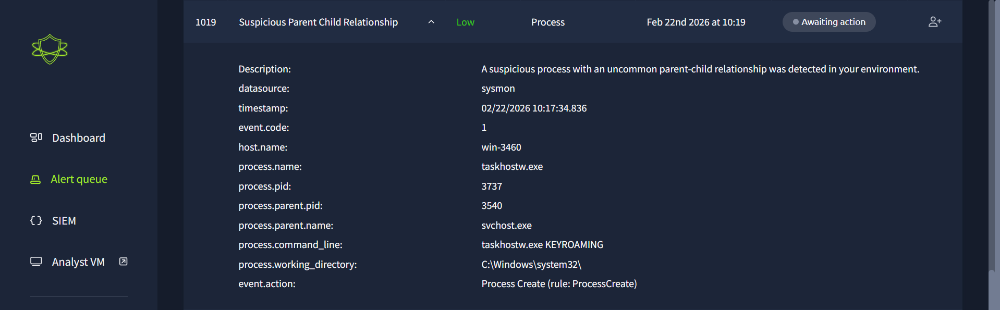

I reviewed the logs carefully.

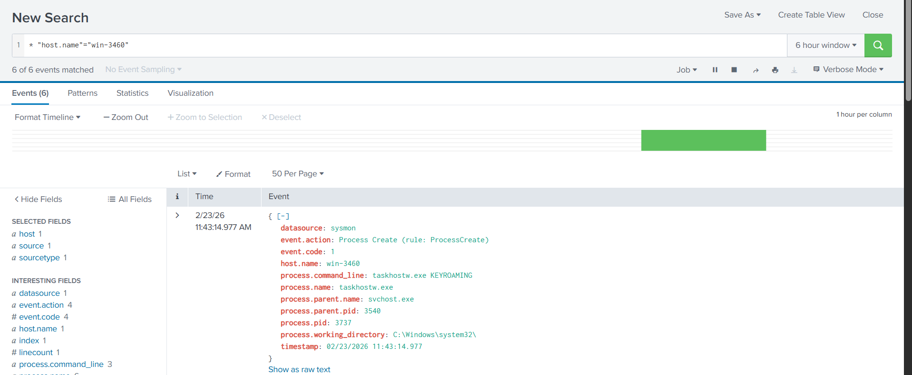

No suspicious child processes or abnormal network activity were observed. The process behavior aligned with normal Windows functionality.

The alert was marked as a **False Positive**.

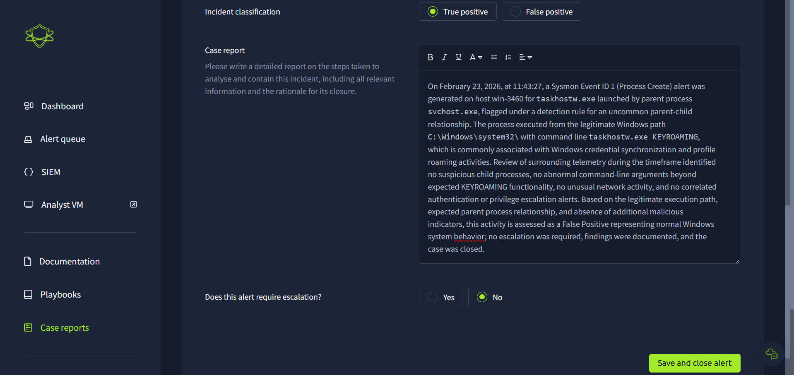

---

### Alert 34 – Suspicious PowerShell File (PowerView.ps1)

The next alert (24.png) had already been partially investigated during earlier medium/high severity analysis.

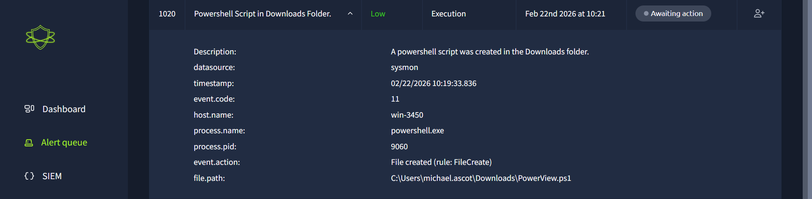

The alert referenced a suspicious PowerShell file located in the **Downloads** folder — specifically `PowerView.ps1`, a known post-exploitation reconnaissance tool.

I located the relevant logs.

The logs confirmed:

- File download  
- Execution of `PowerView.ps1`  
- Activity aligned with attacker reconnaissance  

This was clearly malicious.

The alert was marked as:

**True Positive – Escalation Required**

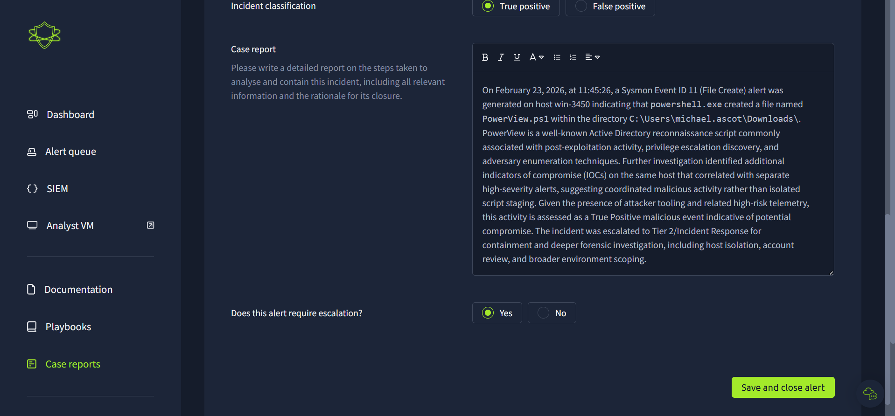

---

### Alert 35 – Low Severity: taskhostw.exe (KEYROAMING)

Another `taskhostw.exe` with `KEYROAMING` alert appeared (25.png).  

Given the compromised state of **win-3450**, I validated the logs again.

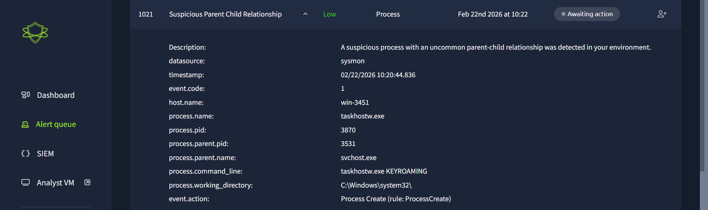

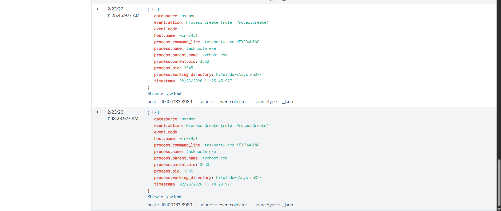

No suspicious activity was observed. This instance behaved normally.

The alert was marked as a **False Positive**.


---

### Alert 36 – Suspicious Robocopy Usage (Data Staging)

As shown in 27.png, the next alert involved the `Robocopy` utility being executed within the **exfiltration** folder on compromised host **win-3450**.


Robocopy is a legitimate Windows tool but is frequently abused by attackers for data staging and bulk file transfer.

I reviewed the logs:


The logs showed:

- Robocopy copying sensitive files  
- Source: mapped network share  
- Destination: exfiltration folder  

This directly aligned with previously confirmed malicious activity.

The alert was classified as:

**True Positive – Escalation Required**


---

> Normally, the SOC simulator ends once all True Positives are identified.  
> However, for completeness, the final alert was also analyzed.

---

### Alert 37 – Final Low Severity: Spam Email

The final alert (39.png) was another spam-style phishing email.


Quick triage confirmed no malicious links, attachments, or user interaction.


The alert was marked as a **False Positive**.


---

## Asset Context: Host win-3450

Reviewing the asset inventory revealed that **win-3450** belonged to the **CEO**.

This significantly increases the impact and severity of the incident:

- High-value target  
- Access to financial and strategic data  
- Increased reputational and regulatory risk  
- Elevated risk of data exfiltration and lateral movement  

---

# Lessons Learned

### 1. Correlation Across Severity Levels Is Critical
Low-severity alerts may initially appear benign but can form part of a larger attack chain when correlated with medium and high-severity events.

### 2. Never Assume Repeated Alerts Are Always False Positives
Even commonly benign processes (`taskhostw.exe`, `TrustedInstaller.exe`) must be re-validated when observed on a compromised host.

### 3. Phishing Remains a Primary Initial Access Vector
The `invoice.pdf.lnk` attachment served as the entry point, leading to:

- PowerShell-based reconnaissance (`PowerView.ps1`)  
- Network share mapping  
- Data staging via Robocopy  
- DNS-based exfiltration  

### 4. Living-off-the-Land Binaries (LOLBins)
Legitimate tools abused in this attack:

- PowerShell  
- Robocopy  
- nslookup  
- net use  

Detection strategies must account for behavioral patterns, not just tool names.

### 5. DNS Monitoring Is Essential
DNS-based exfiltration can bypass traditional perimeter controls. Monitoring for:

- High-frequency queries  
- Encoded subdomains  
- Unusual external domains  

is critical.

### 6. Executive Endpoint Protection Must Be Hardened
Since the compromised asset belonged to the CEO:

- Enhanced monitoring should be applied to executive devices  
- Additional EDR policies may be warranted  
- User awareness training should be reinforced  

---

## Final Summary

This simulation demonstrated a full attack lifecycle:

1. Phishing delivery  
2. User interaction with malicious `.lnk` file  
3. PowerShell post-exploitation  
4. Network share access  
5. Data staging via Robocopy  
6. Cleanup actions  
7. DNS-based data exfiltration  

Through proper prioritization, validation, and correlation, all True Positives were successfully identified and escalated.

---

