## Scenario 2: Phishing Unfolding

This is the second SOC simulation I completed using the **SOC Simulator on TryHackMe**.  
For this scenario, I primarily used **Splunk SIEM**, although the simulation was later repeated using **ELK** and **Microsoft Sentinel**.

One key observation during setup was that log ingestion and data availability in **Splunk** and **ELK** occurred significantly faster compared to **Microsoft Sentinel**.

As the simulator functionality was covered extensively in Scenario 1, I will focus purely on investigation and alert handling in this walkthrough.

---

### Initial Overview

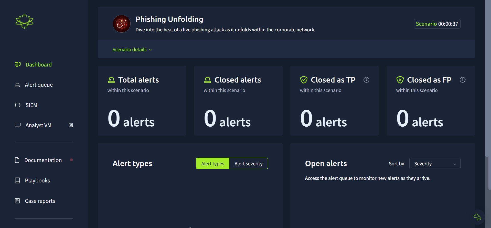

*Figure 1 – SOC dashboard at the start of the Phishing Unfolding scenario.*

Upon entering the scenario, I noticed a documentation notification and proceeded to review it.

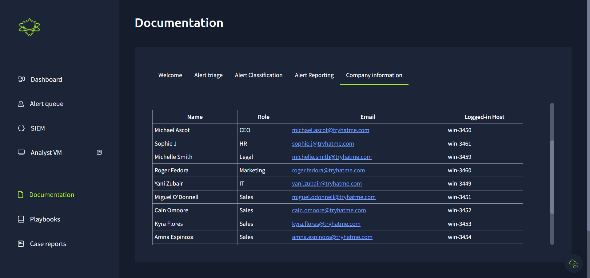

*Figure 2 – Documentation section containing asset inventory, triage guidance, and reporting criteria.*

The documentation provided valuable context, including:

- Company asset inventory  
- Alert triage procedures  
- Alert classification criteria  
- Reporting guidelines  

The welcome page varies depending on the SIEM used. For example, when using **Microsoft Sentinel**, Azure credentials (username and password) are provided:

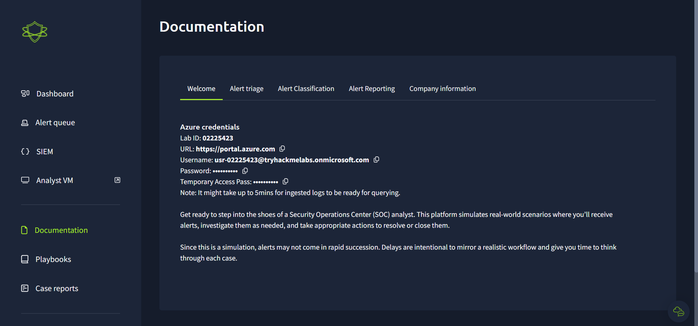

*Figure 3 – Azure credentials shown when using Microsoft Sentinel.*

This credential page does not appear when using ELK or Splunk.

Another notable difference in this scenario was the absence of playbooks, which meant I relied strictly on SOC best practices and investigative reasoning.

---

### Alert 1 – Suspicious Banking Email (Low Severity)

After a few minutes, the first alert appeared.

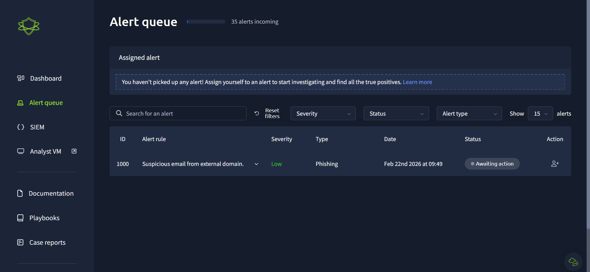

*Figure 4 – First alert appears in the alert queue (36 total alerts expected).*

The alert indicated a suspicious email requesting the recipient to urgently provide banking details.

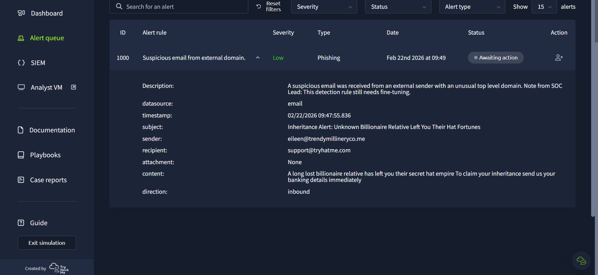

*Figure 5 – Alert details showing a request for banking information.*

I pivoted to Splunk and searched for the recipient to locate the email event.

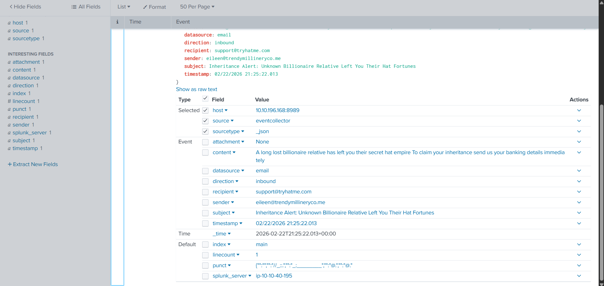

*Figure 6 – Email located in Splunk using recipient-based query.*

I specifically searched the recipient’s activity to determine whether:

- The user replied with sensitive information  
- Any attachments were involved  
- Any embedded URLs were present  

There were **no attachments**, **no URLs**, and **no reply containing sensitive data**. Because no malicious indicators were present and no user interaction occurred, I determined that this email resembled **spam rather than phishing**.

After monitoring briefly to confirm no further suspicious behavior, I wrote a report marking this alert as a **False Positive**, and the case was closed.

---

### Alert 2 – Suspicious Process on Host win-3459

Immediately after closing the previous case, another low-severity alert arrived.

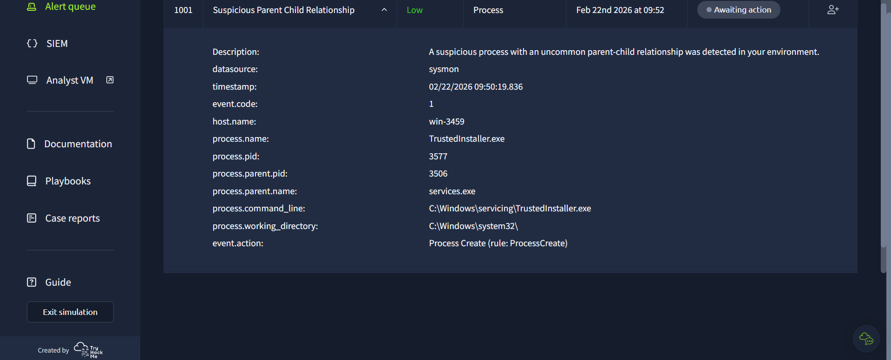

*Figure 7 – Alert indicating a suspicious process on host win-3459.*

I queried the host in Splunk to investigate the process tree.

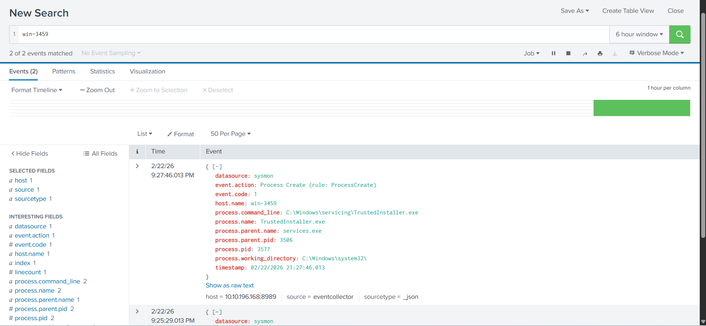

*Figure 8 – Process lineage and event investigation in Splunk.*

My objective was to determine:

- Whether the process was spawned by a malicious parent  
- Whether it spawned additional suspicious child processes  
- Whether there were correlated abnormal events  

Everything appeared legitimate. The process originated from a valid parent process and no abnormal child processes were observed.

I documented the findings and classified the alert as a **False Positive**.

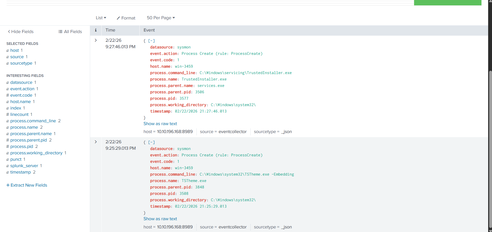

*Figure 9 – Case report marking the alert as False Positive.*

---

### Alert 3 – Additional Suspicious Process

While working on the previous alert, another low-severity suspicious process alert arrived.

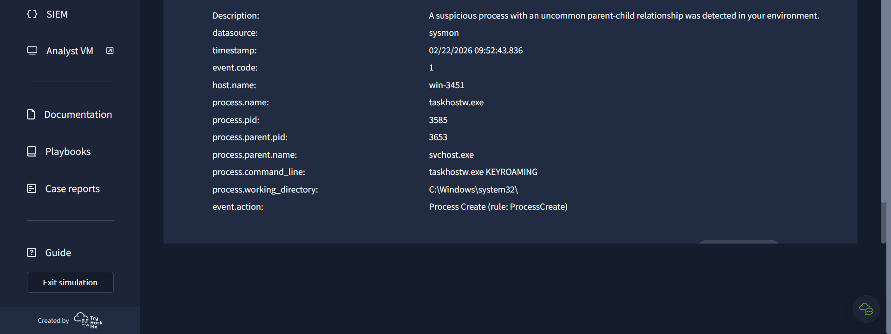

*Figure 10 – Additional suspicious process alert in the queue.*

I noted the host details and searched for the process in Splunk.

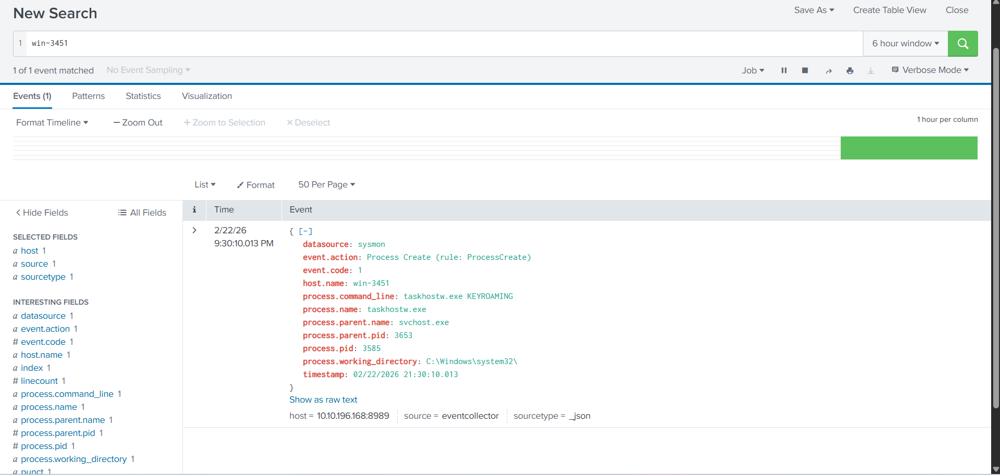

*Figure 11 – SIEM search results for the flagged process.*

There were no additional correlated events beyond the single logged instance. I waited to observe whether further suspicious activity would occur, but none followed.

Given the absence of malicious behavior, unusual spawning activity, or lateral movement indicators, I classified this alert as a **False Positive**.

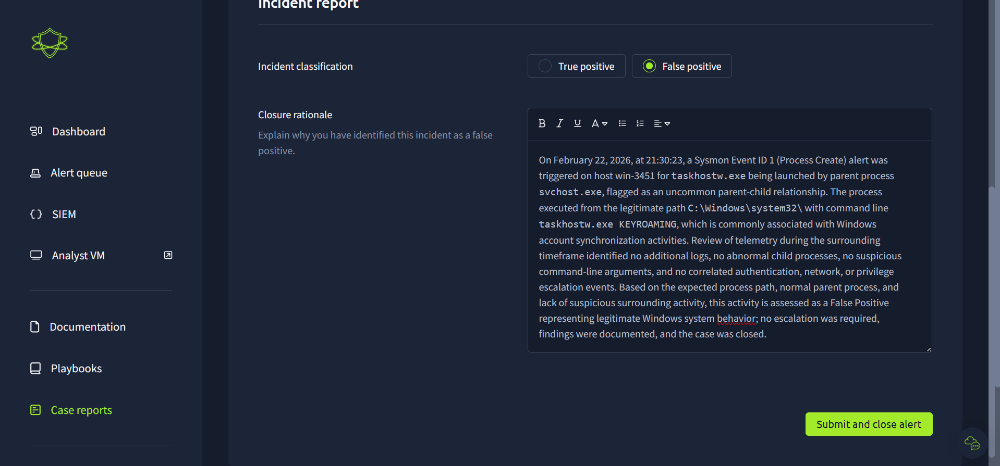

*Figure 12 – Case report marking the second process alert as False Positive.*

---

### Alert 4 – Phishing Email (No Attachments or Links)

While investigating the previous alert, two more low-severity alerts accumulated in the queue. Following SOC best practices, I selected the **oldest alert first**.

*Figure 13 – Phishing email alert without attachments or external links.*

This alert was similar to the earlier spam-style phishing attempt. The email contained no attachments and no external URLs.

I pivoted to the SIEM to check for:

- Any user replies  
- Any outbound communication  
- Any abnormal activity from the recipient  

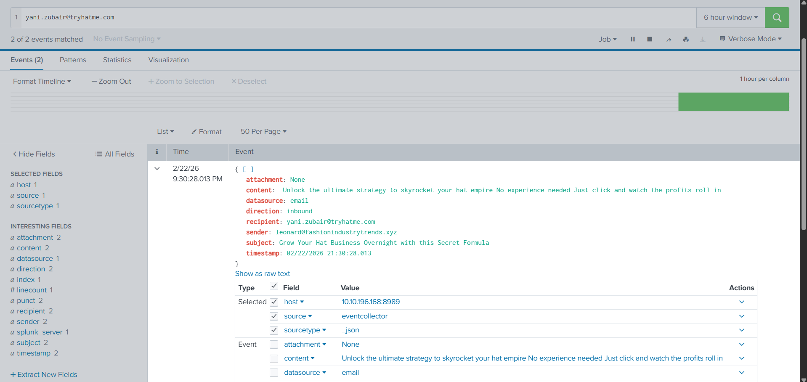

*Figure 14 – SIEM results showing no user interaction.*

After waiting briefly to ensure no delayed activity appeared, I confirmed there was no interaction. I classified the alert as a **False Positive** and documented my findings.

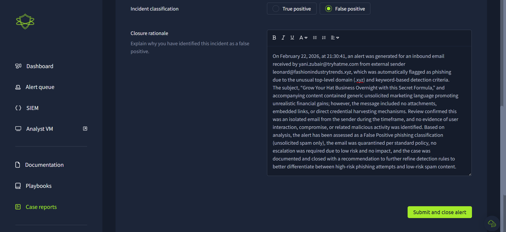

*Figure 15 – Case report marking the alert as False Positive.*

---

### Alert 5 – Additional Phishing Email (No Malicious Indicators)

By this stage, approximately four low-severity alerts were waiting in the queue. Again, I selected the oldest alert.

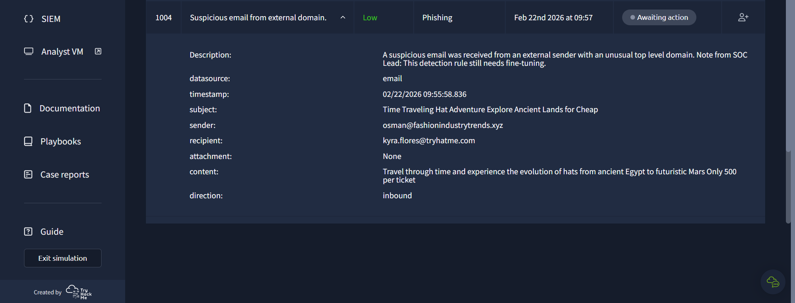

*Figure 16 – Another phishing email alert.*

I repeated the same structured investigation process:

1. Reviewed alert details  
2. Queried the SIEM  
3. Checked for user interaction  
4. Verified presence of attachments or links  

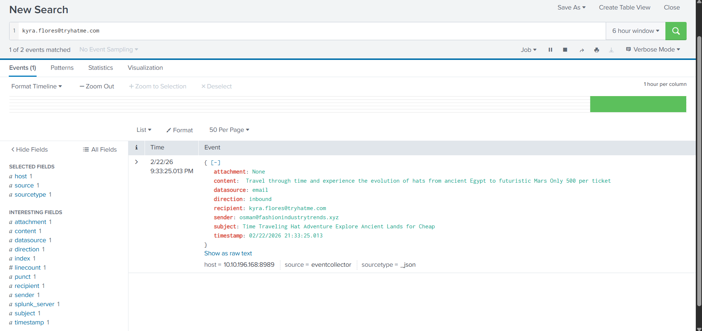

*Figure 17 – SIEM search confirming no malicious activity.*

There were no malicious links, no attachments, and no user interaction. I documented the findings and marked it as a **False Positive**.

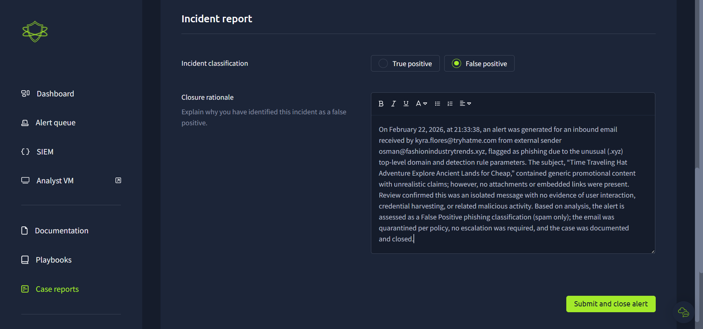

*Figure 18 – Case report confirming False Positive classification.*

---

### Alert 6 – Phishing Email with Malicious Attachment (Host: win-3450)

After closing the previous alert, the number of pending alerts remained unchanged. I moved to the next oldest alert, which involved a phishing email sent to **host win-3450** that contained an attachment — this immediately raised the risk level.

I began by searching for related logs in the SIEM.

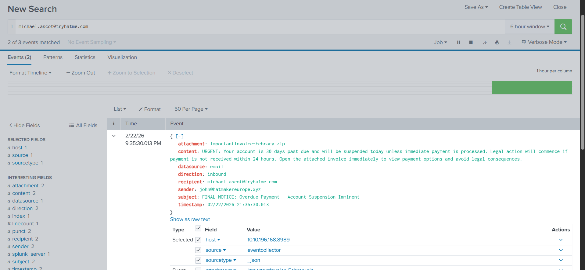

*Figure 19 – SIEM query for email containing attachment.*

While waiting for logs to accumulate, I analyzed the attachment using the Analyst VM.

The ZIP archive itself appeared clean. However, the file inside the archive — `invoice.pdf.lnk` — was flagged as malicious.

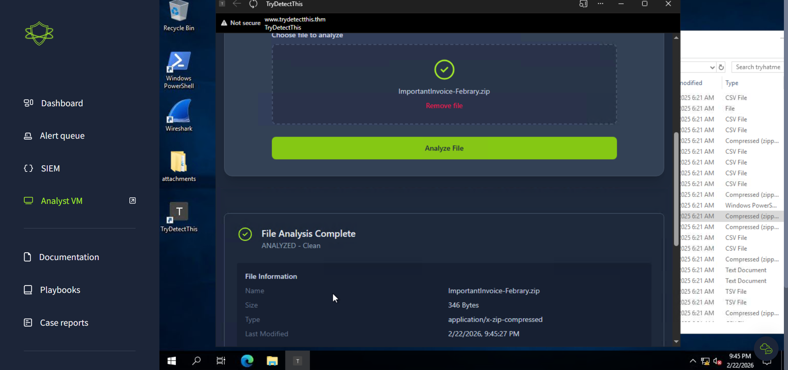

*Figure 20 – ZIP file scan result (clean).*

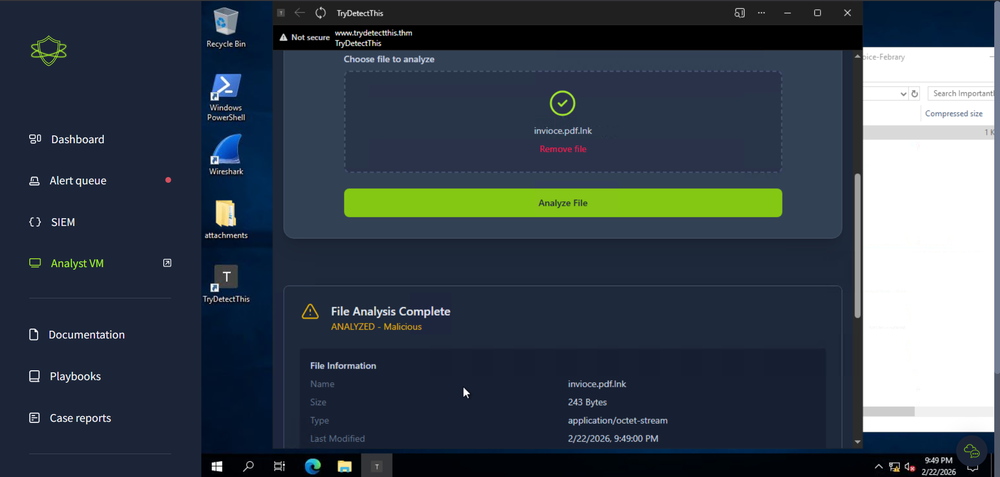

*Figure 21 – Embedded LNK file flagged as malicious.*

This indicated a clear malicious delivery mechanism using a disguised shortcut file.

---

### Alert 7 – Suspicious Process (rdpclip.exe)

While waiting for additional correlated logs, I proceeded to the next alert in the queue, which was also associated with host **win-3450**.

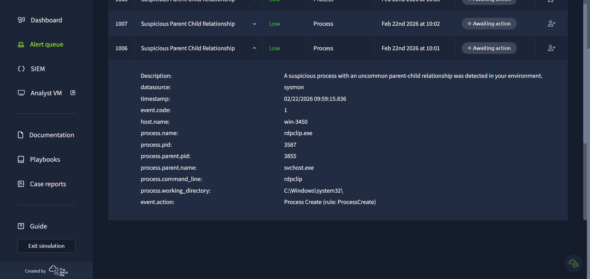

*Figure 22 – Alert showing rdpclip.exe spawned from svchost.exe.*

The process `rdpclip.exe` is related to Remote Desktop Protocol (RDP), so I approached this investigation cautiously due to its potential use in lateral movement.

I queried the SIEM to review the process lineage and surrounding activity.

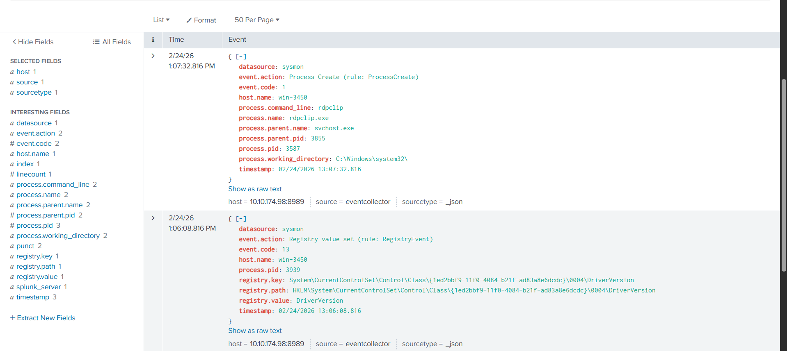

*Figure 23 – Process lineage investigation in SIEM.*

There was no suspicious user interaction prior to the process spawn. Additionally, `rdpclip.exe` was spawned from the expected parent process (`svchost.exe`), which is consistent with legitimate Windows behavior.

Based on these findings, I classified this alert as a **False Positive**.

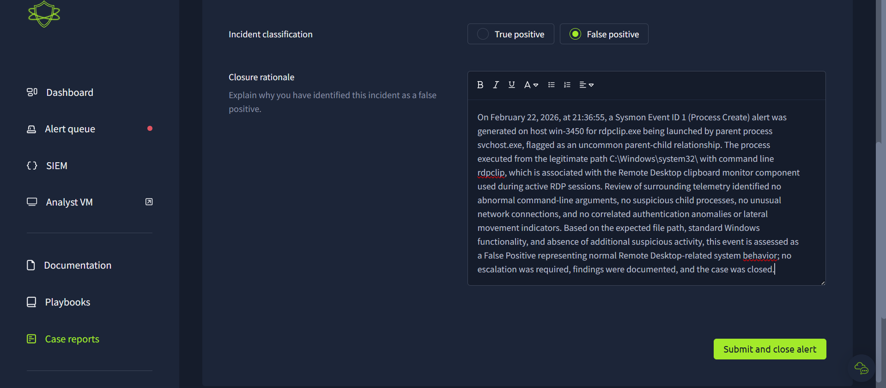

*Figure 24 – Case report marking rdpclip.exe alert as False Positive.*

---

### Alert 8 – taskhostw.exe (KEYROAMING) Process

The next alert involved `taskhostw.exe` with a `KEYROAMING` process spawned from `svchost.exe`.

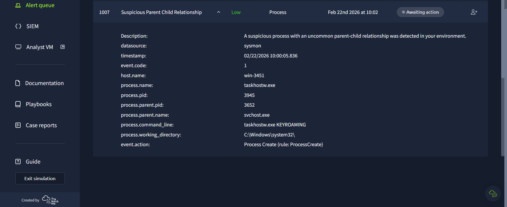

*Figure 25 – taskhostw.exe KEYROAMING process alert.*

Although this appeared to be normal Windows activity at first glance, I validated it in the SIEM to maintain investigative discipline.

*Figure 26 – SIEM validation of taskhostw.exe activity.*

The logs confirmed normal system behavior with no suspicious parent-child process anomalies.

I documented the findings and marked the alert as a **False Positive**.

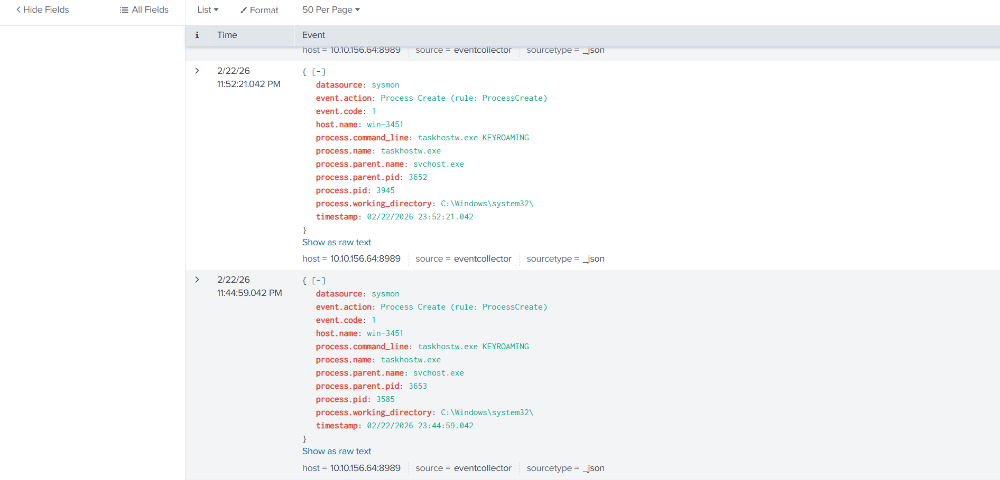

*Figure 27 – Case report confirming False Positive classification.*

---

### Alert 9 – Suspicious Process (WUDFHost.exe)

By this point, there were approximately six alerts waiting in the queue, all still marked as **Low Severity**. Following SOC queue management best practices, I selected the oldest alert.

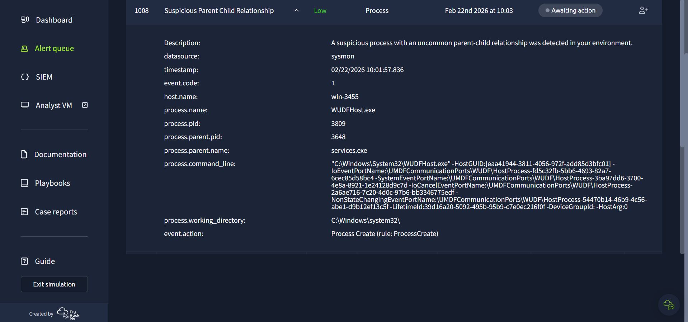

*Figure 28 – Alert indicating WUDFHost.exe spawned from services.exe.*

The alert indicated that `WUDFHost.exe` was spawned from `services.exe`. At first glance, this appeared legitimate, as `WUDFHost.exe` (Windows Driver Foundation Host) commonly runs under `services.exe`.

To ensure there was no misuse, I performed deeper log analysis in the SIEM.

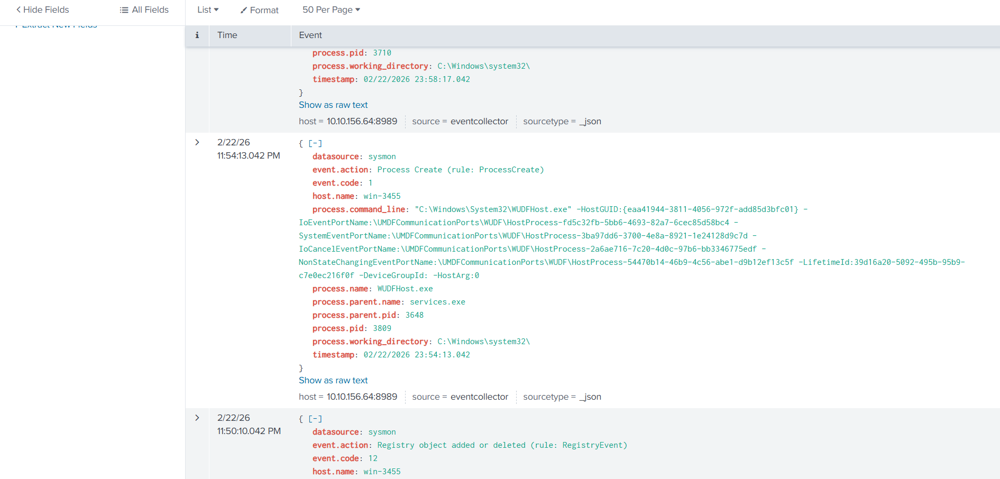

*Figure 29 – Process command-line and event log analysis.*

I carefully reviewed the process command string and surrounding activity to confirm:

- No suspicious child processes were spawned  
- No abnormal command-line arguments were used  
- No unusual outbound network connections were initiated  

Everything aligned with expected system behavior. Based on these findings, I documented the case and marked the alert as a **False Positive**.

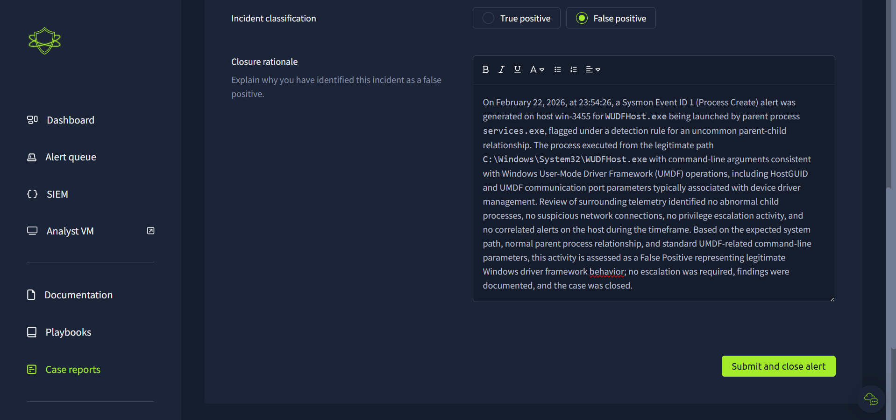

*Figure 30 – Case report confirming False Positive classification.*

---

### Alert 10 – Suspicious Process (rdpclip.exe)

The next alert involved `rdpclip.exe` spawned from `svchost.exe`, similar to a previous alert I had already investigated.

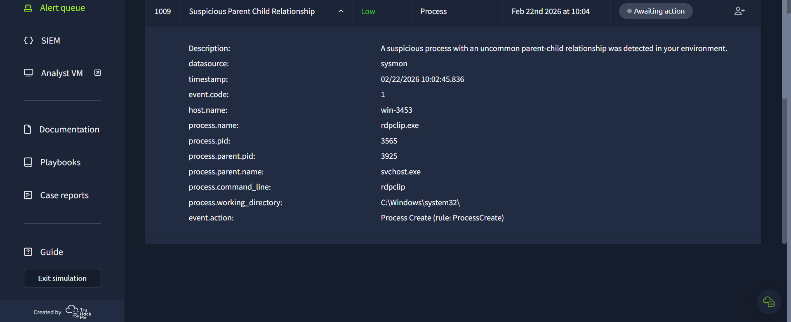

*Figure 31 – rdpclip.exe process alert.*

Given the similarity to the earlier case, I anticipated the outcome but still conducted a quick validation in the SIEM to maintain investigative consistency.

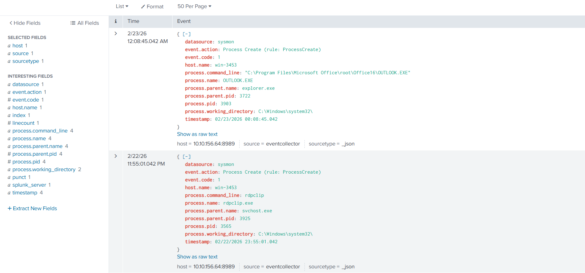

*Figure 32 – SIEM validation of rdpclip.exe process activity.*

The logs confirmed normal behavior with no suspicious activity, lateral movement, or anomalous process spawning.

I documented the findings and marked the alert as a **False Positive**.

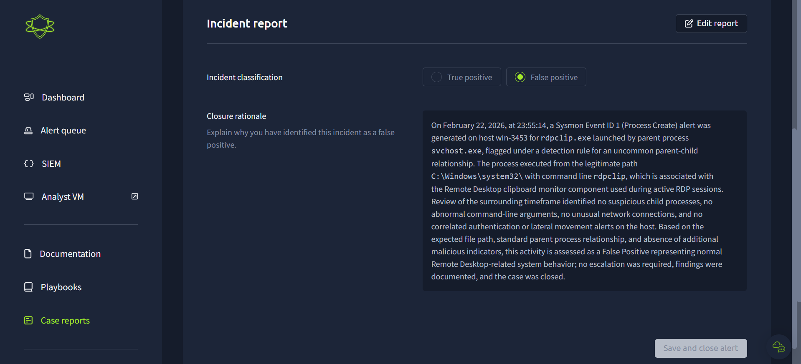

*Figure 33 – Case report confirming False Positive classification.*

---

### Alert 11 – Suspicious Process (WUDFHost.exe – Same Host)

The next alert was again related to `WUDFHost.exe` spawned from `services.exe`, similar to Alert 9 and originating from the same host.

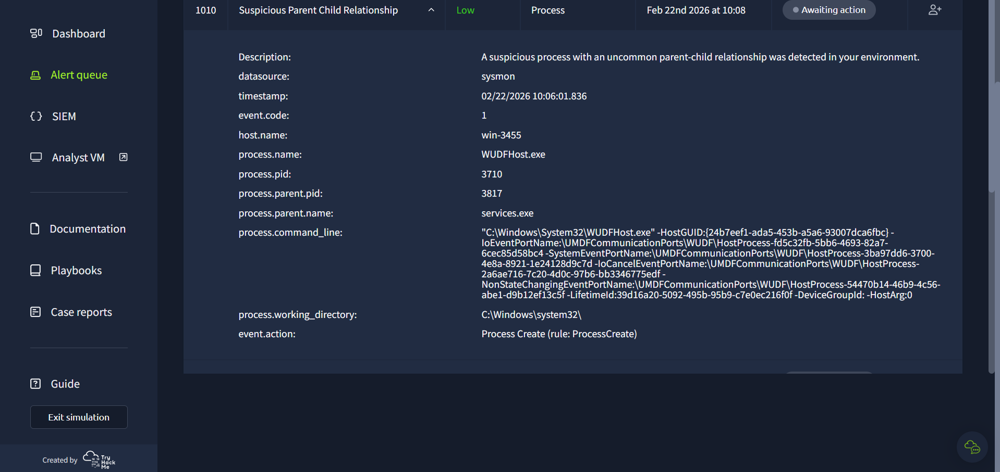

*Figure 34 – Repeated WUDFHost.exe process alert.*

Since this pattern had already been validated, I conducted a quick SIEM verification to confirm consistency.

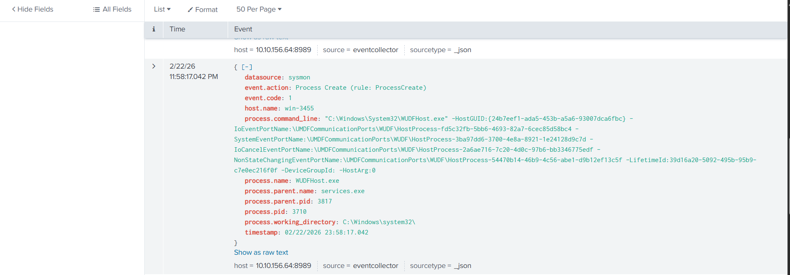

*Figure 35 – Log validation for repeated WUDFHost.exe alert.*

The logs showed expected Windows system behavior with no suspicious command-line arguments or child processes.

I completed the case documentation and classified the alert as a **False Positive**.

*Figure 36 – Case report marking the alert as False Positive.*

---

*(To be continued in the next section.)*
